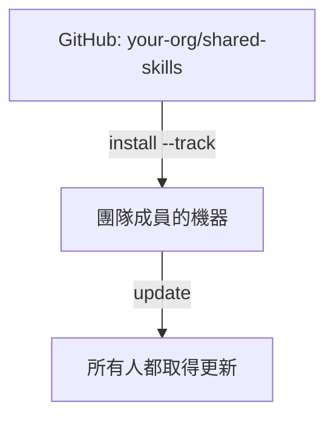

# 全組織 Skills

透過 tracked repositories 在所有專案之間分享 skills。

## 概覽



---

## 使用情境

| 情境 | 範例 |
|----------|---------|
| **公司程式碼標準** | 在所有 repo 中強制一致的命名、錯誤處理與架構 |
| **安全稽核 skills** | 套用到每個專案的全組織安全審查檢查清單 |
| **部署知識** | 標準 CI/CD 模式、基礎設施慣例、發佈流程 |
| **程式碼審查準則** | 所有團隊與專案間一致的審查標準 |
| **跨專案模式** | 共用的 API 設計模式、記錄標準、測試框架 |

---

## 為什麼要進行組織分享？

| 沒有 Organization Skills | 有 Organization Skills |
|-----------------------------|--------------------------|
| 「嘿，去 Slack 抓一下最新的部署 skill」 | `skillshare update --all` |
| 在機器之間複製貼上 skills | 一個指令安裝所有東西 |
| 「你的 skill 是哪個版本？」 | 每個人都從同一個 source Sync |
| Skills 散落在各文件/repo 中 | 組織有一個經過整理的 repo |

---

## 給團隊負責人

### 步驟 1：建立 skills repo

為你組織的 skills 建立一個 GitHub/GitLab/Bitbucket repository。

```bash
mkdir org-skills && cd org-skills
git init

# 建立 skill 結構
mkdir -p frontend/ui backend/api devops/deploy

# 新增 skills
echo "---
name: acme-ui
description: Frontend UI patterns
---
# UI Skill
..." > frontend/ui/SKILL.md

git add .
git commit -m "Initial skills"
git push -u origin main
```

### 步驟 2：新增 .skillignore（選用）

如果你的 repo 中有不該被視為 skills 的內部工具或 CI 腳本，請在 repo 根目錄建立 `.skillignore`：

```text title=".skillignore"
# CI/CD 輔助工具 — 不是可安裝的 skills
ci-scripts
_internal-*
```

如果個別團隊成員需要 `.skillignore` 阻擋的某個 skill，可以在同一目錄建立 `.skillignore.local`（不提交到 git）來本機覆寫：

```text title=".skillignore.local"
!_internal-my-tool
```

### 步驟 3：分享安裝指令

把這個發給你的團隊：

```bash
skillshare install github.com/your-org/org-skills --track && skillshare sync
```

只需要部分 skills 的團隊成員可以使用 `--exclude`：

```bash
skillshare install github.com/your-org/org-skills --all --exclude devops-deploy
```

---

## 給團隊成員

### 初始設定

```bash
# 安裝 organization skills repo
skillshare install github.com/org/skills --track

# Sync 到你的 AI CLIs
skillshare sync
```

### 日常使用

```bash
# 檢查更新
skillshare update --all
skillshare sync
```

---

## Nested Skills 與自動攤平

用資料夾組織 skills — skillshare 會自動攤平它們以相容 AI CLI：

```
SOURCE                              TARGET
(your organization)                 (what AI CLI sees)
────────────────────────────────────────────────────────────
_org-skills/
├── frontend/
│   ├── react/          ───►   _org-skills__frontend__react/
│   └── vue/            ───►   _org-skills__frontend__vue/
├── backend/
│   └── api/            ───►   _org-skills__backend__api/
└── devops/
    └── deploy/         ───►   _org-skills__devops__deploy/

• _ prefix = tracked repository
• __ (double underscore) = path separator
```

**好處：**
- 在你的 repo 中保留邏輯上的資料夾組織
- AI CLIs 會看到它們期望的扁平結構
- 攤平後的名稱會保留原始路徑，以便追溯

詳情請參閱 [Tracked Repositories](/docs/understand/tracked-repositories#nested-skills--auto-flattening)。

---

## 衝突偵測

當多個 skills 共用相同的 `name` 欄位時，sync 會檢查在套用 `include`/`exclude` 篩選條件後，它們是否真的會落在同一個 target 上。

**篩選條件隔離了衝突** — 僅供參考：

```
ℹ Duplicate skill names exist but are isolated by target filters:
  'ui' (2 definitions)
```

**衝突發生在同一個 target 上** — 需要處理的警告：

```
⚠ Target 'claude': skill name 'ui' is defined in multiple places:
  - _team-a/frontend/ui
  - _team-b/components/ui
Rename one in SKILL.md or adjust include/exclude filters
```

**解決方式：** 使用具命名空間的名稱，或用篩選條件分流：

```yaml
# 選項 1：在 SKILL.md 中加上命名空間
name: team-a-ui

# 選項 2：用篩選條件分流（global 設定）
targets:
  codex:
    path: ~/.codex/skills
    include: [_team-a__*]
  claude:
    path: ~/.claude/skills
    include: [_team-b__*]
```

```yaml
# 選項 2：用篩選條件分流（project 設定）
targets:
  - name: claude
    exclude: [codex-*]
  - name: codex
    include: [codex-*]
```

完整語法與範例請參閱 [Target Filters](/docs/reference/targets/configuration#include--exclude-target-filters)。

---

## 多個 Organization Repos

為不同團隊或關注領域安裝多個 repo：

```bash
# 前端團隊
skillshare install github.com/org/frontend-skills --track --name frontend

# 後端團隊
skillshare install github.com/org/backend-skills --track --name backend

# DevOps 團隊
skillshare install github.com/org/devops-skills --track --name devops

skillshare sync
```

全部更新：
```bash
skillshare update --all
skillshare sync
```

---

## 私有 Repositories

**SSH**（建議用於開發者機器）：

```bash
skillshare install git@github.com:org/private-skills.git --track
```

**搭配 token 的 HTTPS**（建議用於 CI/CD）：

```bash
export GITHUB_TOKEN=ghp_your_token
skillshare install https://github.com/org/private-skills.git --track
```

官方 token 文件：
- GitHub: [Managing your personal access tokens](https://docs.github.com/en/authentication/keeping-your-account-and-data-secure/managing-your-personal-access-tokens)
- GitLab: [Token overview](https://docs.gitlab.com/security/tokens/)
- Bitbucket: [Access tokens](https://support.atlassian.com/bitbucket-cloud/docs/access-tokens/)

### CI/CD 設定

**GitHub Actions:**

```yaml
- name: Install org skills
  env:
    GITHUB_TOKEN: ${{ secrets.GITHUB_TOKEN }}
  run: |
    skillshare install https://github.com/org/skills.git --track
    skillshare sync
```

**GitLab CI:**

```yaml
install-skills:
  script:
    - skillshare install https://gitlab.com/org/skills.git --track
    - skillshare sync
  variables:
    GITLAB_TOKEN: $CI_JOB_TOKEN
```

**Bitbucket Pipelines:**

```yaml
- step:
    name: Install org skills
    script:
      - skillshare install https://bitbucket.org/team/skills.git --track
      - skillshare sync
    env:
      BITBUCKET_USERNAME: $BITBUCKET_USERNAME   # for app passwords
      BITBUCKET_TOKEN: $BITBUCKET_TOKEN
```

所有支援的 token 請參閱 [Environment Variables](/docs/reference/appendix/environment-variables#git-authentication)。

---

## 指令參考

| 指令 | 說明 |
|---------|------|
| `install <url> --track` | 將 repo clone 為 tracked repository |
| `update <name>` | 對特定的 tracked repo 執行 git pull |
| `update --all` | 更新所有 tracked repos |
| `uninstall <name>...` | 移除 tracked repo(s) |
| `list` | 列出所有 skills 與 tracked repos |
| `status` | 顯示 sync 狀態 |

---

## Organization Agents

tracked organization repo 除了 skills 之外，也可以一併發佈 **agents**。將它們放在 `skills/` 旁邊的頂層 `agents/` 目錄中：

```
your-org/org-shared/
├── skills/                  # 被偵測為 skills
│   ├── api-design/
│   │   └── SKILL.md
│   └── security/
│       └── SKILL.md
└── agents/                  # 被偵測為 agents
    ├── reviewer.md
    └── auditor.md
```

當隊友執行 `skillshare install github.com/your-org/org-shared --track` 時，兩個目錄都會自動被偵測到。`skillshare update --all` 會讓兩者保持 Sync，而 `skillshare sync`（或 `skillshare sync agents`）會將 agents 傳播到支援 agent 的 targets（Claude、Cursor、Augment、OpenCode）。

org repo 內的 `.agentignore` 檔案在磁碟上會被遵循，但通常應該放在消費端的 source 根目錄（或 `.agentignore.local`），這樣個別機器就能在不修改上游 repo 的情況下退出。完整的偵測規則請參閱 [Agents](/docs/understand/agents)。

---

## Organization Skills vs Project Skills

| | Organization Skills | Project Skills |
|---|---|---|
| **範圍** | 機器上的所有專案 | 單一 repository |
| **Source** | `~/.config/skillshare/skills/_repo/` | `.skillshare/skills/` |
| **Install** | `skillshare install <url> --track` | `skillshare install <url> -p` |
| **分享方式** | 每位成員各自安裝 tracked repo | 提交到 project 的 git repo |
| **最適合** | 程式碼標準、安全、組織模式 | API 慣例、領域脈絡、專案工具 |
| **共存性** | 可與 project skills 並存 | 可與 organization skills 並存 |

:::tip 兩者並用
Organization skills 提供全公司的標準。Project skills 提供 repo 特有的脈絡。兩者互補 — 同時使用能帶來最好的開發者體驗。
:::

---

## 最佳實務

### 給團隊負責人

1. **使用清楚的結構**：依功能組織（frontend、backend、devops）
2. **為 skills 加上命名空間**：使用 `org-skill-name` 避免衝突
3. **記錄需求**：附有設定說明的 README
4. **版本控制**：對穩定版本使用 tag

### 給團隊成員

1. **定期更新**：每天執行 `skillshare update --all`
2. **回報問題**：如果某個 skill 不能用，告訴維護者
3. **提出改善建議**：向 skills repo 開 PR

---

## 參見

- [Tracked Repositories](/docs/understand/tracked-repositories) — 概念詳情
- [install](/docs/reference/commands/install) — 使用 `--track` 安裝
- [update](/docs/reference/commands/update) — 更新 tracked repos
- [Project Setup](./project-setup.md) — 專案層級的分享
- [Cross-Machine Sync](./cross-machine-sync.md) — 個人 Sync
