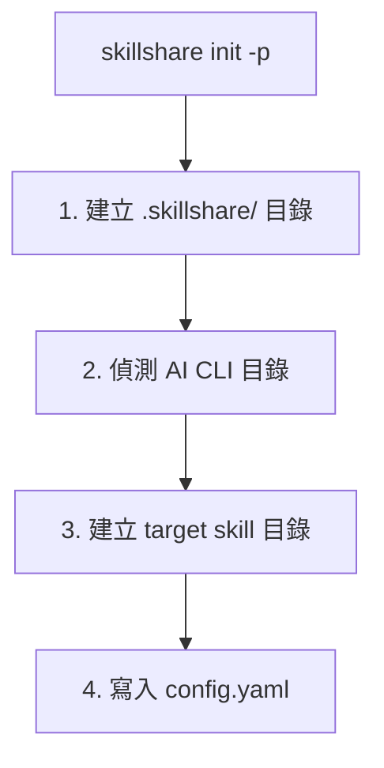

# Project 設定

從頭開始設定 project 層級的 skills — 侷限於單一 repository，並透過 git 與團隊分享。

## 何時使用 Project Mode

| 情境 | 範例 | 使用哪種 |
|----------|---------|-----|
| Monorepo 上手 | 新人 clone repo，立刻取得所有專案脈絡 | **Project mode** |
| API 慣例 | 「所有端點都必須使用 camelCase，並回傳標準錯誤格式」 | **Project mode** |
| 領域特定脈絡 | 金融法規規則、醫療合規指南 | **Project mode** |
| 部署知識 | 「透過 `make deploy-staging` 部署到 staging，需要 VPN」 | **Project mode** |
| 專案工具 | 自訂測試模式、遷移腳本、build 設定 | **Project mode** |
| 在所有專案間共用的 skills | 全公司程式碼標準、安全稽核 | Organization mode |
| 多台機器上的個人 skills | 個人格式化偏好、workflow 捷徑 | Global mode |

---

## 逐步設定

### 步驟 1：初始化

在你的專案根目錄執行 `skillshare init -p`：

```bash
cd my-project
skillshare init -p
```



:::tip 自動偵測
初始化後，只要你 `cd` 進入這個目錄，skillshare 就會自動偵測 project mode。之後的指令都不需要 `-p` 旗標。
:::

你也可以直接指定 targets：

```bash
skillshare init -p --targets claude,cursor
```

### 步驟 2：建立本機 Skills

手動建立 skills，或使用 `skillshare new`：

```bash
# 使用 skillshare new
skillshare new my-skill -p

# 或者手動建立
mkdir -p .skillshare/skills/my-skill
cat > .skillshare/skills/my-skill/SKILL.md << 'EOF'
---
name: my-skill
description: Project-specific coding guidelines
---
# My Skill

Your skill content here...
EOF
```

### 步驟 3：安裝遠端 Skills

從 GitHub 安裝 skills 到專案中：

```bash
skillshare install anthropics/skills/skills/pdf -p
skillshare install github.com/team/shared-skills/review -p

# 使用 --into 組織到子目錄中
skillshare install anthropics/skills -s pdf --into tools -p
# → .skillshare/skills/tools/pdf/
```

遠端 skills 會：
- 安裝到 `.skillshare/skills/<name>/`（若使用 `--into` 則為 `.skillshare/skills/<into>/<name>/`）
- 記錄在 `.skillshare/config.yaml` 的 `skills:` 底下
- 加入到 `.skillshare/.gitignore`（cloned 的內容不會被提交；`logs/`、`trash/` 與 `backups/` 預設會被忽略）

### 步驟 4：Sync 到 Targets

```bash
skillshare sync
```

建立從 `.skillshare/skills/` 到每個 target 目錄的 symlink。自動偵測 project mode。

### 步驟 5：提交到版本控制

```bash
git add .skillshare/
git commit -m "Add project-level skills"
```

**會提交什麼：**
- `.skillshare/config.yaml` — targets 與遠端 skill 清單
- `.skillshare/skills.lock.json` — 每個遠端 skill 釘選的 commit，讓所有人安裝到相同版本
- `.skillshare/.gitignore` — 專案 logs、trash、backups 與 cloned skills 的忽略模式
- `.skillshare/skills/<local-skills>/` — 本機 skill 內容

**會被忽略什麼：**
- `.skillshare/logs/`（操作與稽核記錄）
- `.skillshare/trash/`（軟刪除的 skills，7 天後自動清理）
- `.skillshare/backups/`（來自 sync 與 backup 指令的 agent 備份）
- 遠端 skill 目錄（從 config 重新安裝）

### 選用：提交記錄檔

如果你想要把專案的記錄檔納入版本控制，請在 `.skillshare/.gitignore` 中新增覆寫規則：

```gitignore
# 使用者覆寫：追蹤 logs
!logs/
!logs/*.log
```

如果根目錄的 `.gitignore` 忽略了 `.skillshare/`，也要在那裡加上對應的取消忽略規則。

---

## 新團隊成員上手

### 沒有 skillshare

1. Clone repo
2. 閱讀 README 找出要安裝哪些 skills
3. 手動複製或安裝每個 skill
4. 分別設定每個 AI CLI 工具
5. 祈禱你沒有漏掉什麼

### 使用 skillshare

```bash
git clone github.com/team/my-project
cd my-project
skillshare install -p && skillshare sync
```

完成。所有專案 skills 都已安裝並 Sync。`skillshare install -p`（不帶 URL）會讀取 `.skillshare/config.yaml`，並自動安裝所有列出的遠端 skills。同樣的模式在 global mode 也適用 — `skillshare install`（不帶參數）會讀取 `~/.config/skillshare/config.yaml`。

---

## 自訂 Target 路徑

Targets 同時支援已知名稱與自訂路徑：

```yaml
# .skillshare/config.yaml
targets:
  - claude                    # 已知名稱 → .claude/skills/
  - cursor                         # 已知名稱 → .cursor/skills/
  - name: custom-tool              # 自訂路徑
    path: ./tools/ai/skills        # 相對於專案根目錄
  - name: another-tool
    path: ~/global/path/skills     # 絕對路徑，支援 ~ 展開
```

---

## 完整設定範例

```yaml
targets:
  - claude
  - cursor
  - name: windsurf
    path: .windsurf/skills

skills:
  - name: pdf
    source: anthropic/skills/pdf
  - name: code-review
    source: github.com/team/skills/code-review
```

---

## Web Dashboard

Web dashboard 支援 project mode — 以視覺化方式管理 skills、targets、sync 與 config：

```bash
cd my-project
skillshare ui -p
```

如果 `.skillshare/config.yaml` 存在，直接執行 `skillshare ui` 也可以（會自動偵測）。

在 project mode 下，dashboard 會：
- 在側邊欄顯示 **「Project」徽章**
- 隱藏 **Git Sync**（請使用你專案自己的 git）
- 在 Config 頁面編輯 **`.skillshare/config.yaml`**
- 在安裝遠端 skills 後自動 **同步** `skills:` 項目

---

## 與 Global Mode 共存

Project 與 global（organization）skills 各自獨立運作：

```
Organization level                  Project level
~/.config/skillshare/skills/        .skillshare/skills/
├── personal-skill/                 ├── project-skill/
└── _company-std/                   └── remote-skill/
         │                                   │
         ▼                                   ▼
   ~/.claude/skills/                .claude/skills/
   (system-wide targets)            (project-local targets)
```

- Project targets 是**專案本機**的（例如專案內的 `.claude/skills/`）
- Organization targets 是**系統全域**的（例如 `~/.claude/skills/`）
- 它們不會衝突 — 不同的目錄、不同的範圍

### 真實案例：Alice 的兩個專案

Alice 同時負責一個金融 app 與一個行銷 dashboard。她擁有：

- **Organization skills**：公司程式碼標準、安全稽核（隨處可用）
- **Finance project skills**：法規合規、金融 API 慣例
- **Marketing project skills**：分析模式、A/B 測試指南

```bash
cd ~/finance-app
skillshare status     # 顯示 finance project skills + 系統全域 targets 中的 org skills

cd ~/marketing-dash
skillshare status     # 顯示 marketing project skills + 相同的 org skills
```

每個專案都有自己的脈絡，而 organization 標準則全域套用。

---

## 參見

- [Project Skills](/docs/understand/project-skills) — 概念說明
- [Project Workflow](/docs/how-to/daily-tasks/project-workflow) — 日常使用
- [Organization-Wide Skills](./organization-sharing.md) — 團隊分享
- [init](/docs/reference/commands/init) — 使用 `--project` 進行 Init
