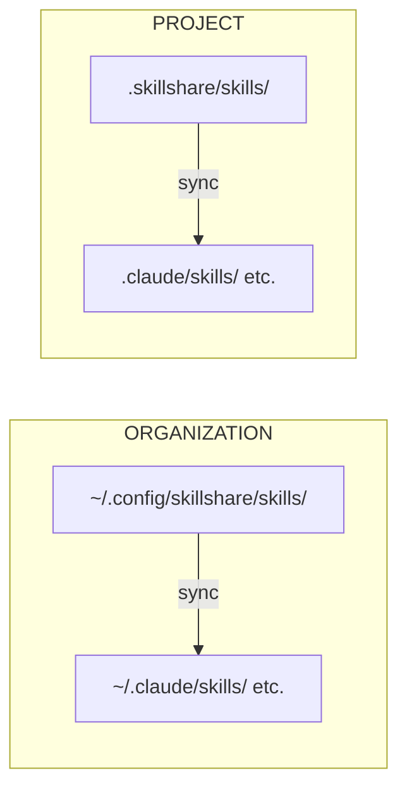

# 介紹

**skillshare** 是一套 CLI 工具，能把 AI CLI skills 從單一 source 同步到你所有的 AI 編碼助理。

## 為什麼選擇 skillshare？

安裝類工具只負責把 skills 放進 agent，**skillshare 則負責讓它們持續保持同步。**

| | 一次性安裝工具 | skillshare |
|---|-------------------|------------|
| 安裝之後 | 需手動執行更新指令 | **Merge sync** — 逐一 skill 建立 symlink，保留本機既有 skills |
| 更新某個 skill | 執行更新指令／重跑安裝 | **直接改 source**，變更立即生效 |
| 把修改收回來 | — | **雙向同步** — 可從任一 agent collect 回來 |
| 跨機器 | 每台機器都要重跑安裝 | **git push/pull** — 一道指令完成同步 |
| 本機 + 已安裝 | 分開各自管理 | **統一** 收進單一 source 目錄 |
| 組織內共享 | commit skills.json 或重新安裝 | **Tracked repos** — git pull 即可更新 |
| 專案 skills | 每個 repo 各自複製，久了就各走各的 | **Project mode** — 自動偵測，透過 git 共享 |
| 安全稽核 | 無 | **內建** — 安裝時自動掃描，另有 `audit` 指令 |
| AI 整合 | 只能手動下 CLI | **內建 skill** — AI 可直接操作 |

## 快速開始

```bash
# Install
curl -fsSL https://raw.githubusercontent.com/runkids/skillshare/main/install.sh | sh

# Initialize (auto-detects CLIs, sets up git)
skillshare init

# Install a skill
skillshare install anthropics/skills/skills/pdf

# Sync to all targets
skillshare sync
```

完成。你的 skills 現在已經同步到所有 AI CLI 工具了。

:::tip[不安裝也能試]
想先四處看看？可以用 [Docker Playground](/docs/how-to/advanced/docker-sandbox#playground)，一道指令，不必在本機安裝：

```bash
git clone https://github.com/runkids/skillshare.git && cd skillshare
make playground
```
:::

## 運作方式



改 source → 所有 targets 一起更新。改 target → 變更會回寫到 source（透過 symlink）。

## 主要特色

- **自動偵測** — `cd` 進入含有 `.skillshare/` 的專案，skillshare 會自動切換到 project mode
- **雙層架構** — 用組織層級 skills 統一公司規範，再用專案層級 skills 補上 repo 情境
- **即時更新** — 基於 symlink 的 sync，編輯後立刻反映到所有 AI 工具
- **團隊就緒** — 組織 skills 走 tracked repos，專案 skills 走 git commit
- **支援任何 Git 服務** — 可從 GitHub、GitLab、Bitbucket、Azure DevOps、AtomGit、Gitee 或任何自架 Git 安裝、更新與檢查
- **安全稽核** — 掃描 skills 是否含 prompt injection、資料外洩等威脅，安裝時自動掃描

## 支援平台

| 平台 | Source 路徑 | 連結型態 |
|----------|-------------|-----------|
| macOS/Linux | `~/.config/skillshare/skills/` | Symlinks |
| Windows | `%AppData%\skillshare\skills\` | NTFS Junctions |

## 下一步

### 個人開發者

1. [First Sync](/docs/getting-started/first-sync) — 5 分鐘完成第一次同步
2. [建立 Skills](/docs/how-to/daily-tasks/creating-skills) — 寫出你的第一個 skill
3. [跨機器同步](/docs/how-to/sharing/cross-machine-sync) — 讓多台機器的 skills 保持一致

### 團隊負責人／組織

1. [組織層級 Skills](/docs/how-to/sharing/organization-sharing) — 把規範共享給整個團隊
2. [專案設定](/docs/how-to/sharing/project-setup) — 建立專案範圍的 skills
3. [安全稽核](/docs/reference/commands/audit) — 部署前先掃描第三方 skills

### 已經有 Skills 了？

- [從既有 Skills 遷移](/docs/getting-started/from-existing-skills) — 遷移與整併

### 深入了解

- [核心概念](/docs/understand) — Source、targets、sync 模式
- [指令參考](/docs/reference/commands) — 所有可用指令
- [Docker Sandbox](/docs/how-to/advanced/docker-sandbox) — 在隔離環境中試用 skillshare
- [FAQ](/docs/troubleshooting/faq) — 常見問題
