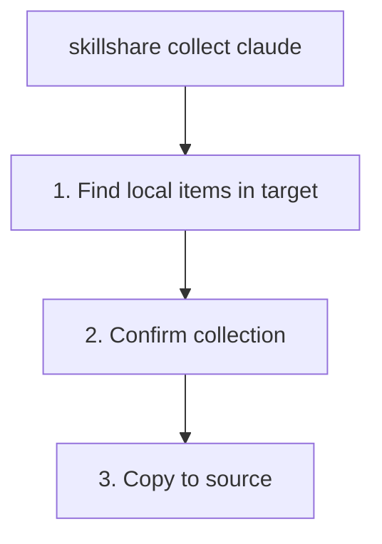

# collect

從 target 收集本機的 skill 或 agent 回 source。

```bash
skillshare collect claude           # From specific target
skillshare collect --all            # From all targets
skillshare collect claude --dry-run # Preview
skillshare collect agents claude    # Collect agents instead of skills
```

## 何時使用

當你直接在 target 目錄中建立或編輯了資源，想把它們拉回 source of truth 時，就使用 `collect`：

1. 加入 source 以便分享
2. 同步到其他 AI CLI
3. 用 git 備份

範例：

- Skills: `~/.claude/skills/my-skill/`
- Agents: `~/.claude/agents/tutor.md`

## 執行流程



:::tip
收集過程會自動排除 `.git/` 目錄。如果你直接把 skill repo git-clone 到 target 目錄中，只有 skill 內容會被複製，repository metadata 不會跟著移動。
:::

:::note
網頁儀表板的 **Collect** 頁面目前只支援 skills。若要 `collect agents`，請使用 CLI。
:::

## 選項

| Flag | Description |
|------|-------------|
| `--all, -a` | Collect from all targets |
| `--force, -f` | Overwrite existing items in source and skip confirmation |
| `--dry-run, -n` | Preview without making changes |
| `--json` | Output JSON and skip confirmation; existing items in source still require `--force` to overwrite |

## JSON 輸出

```bash
skillshare collect claude --json
```

```json
{
  "pulled": ["new-skill", "another-skill"],
  "skipped": [],
  "failed": {},
  "dry_run": false,
  "duration": "0.123s"
}
```

搭配 `--dry-run` 可預覽而不做任何變更：

```bash
skillshare collect claude --json --dry-run
skillshare collect -p --json
skillshare collect -p agents --json
```

## 輸出範例

```bash
$ skillshare collect claude

Local skills found
  ℹ new-skill       [claude] ~/.claude/skills/new-skill
  ℹ another-skill   [claude] ~/.claude/skills/another-skill

Collect these skills to source? [y/N]: y

Collecting skills
  ✓ new-skill: copied to source
  ✓ another-skill: copied to source

Run 'skillshare sync' to distribute to all targets
```

## 處理衝突

如果 source 中已存在同名項目，collection 預設會跳過它：

```bash
$ skillshare collect claude

Collecting skills
  ⚠ my-skill: skipped (already exists in source, use --force to overwrite)

# To overwrite:
$ skillshare collect claude --force

$ skillshare collect agents claude

Collecting agents
  ⚠ tutor.md: skipped (already exists in source, use --force to overwrite)
```

## 工作流程

在 target 中建立 skill 之後的典型工作流程：

```bash
# 1. Create skill in Claude
# (edit ~/.claude/skills/my-new-skill/SKILL.md)

# 2. Collect to source
skillshare collect claude

# 3. Sync to all other targets
skillshare sync

# 4. Commit to git (optional)
skillshare push -m "Add my-new-skill"
```

對於 agents，使用專屬的 collect/sync 組合：

```bash
skillshare collect agents claude
skillshare sync agents
```

## 另請參閱

- [sync](/docs/reference/commands/sync) — 從 source 同步到 targets
- [diff](/docs/reference/commands/diff) — 查看僅存在於本機的 skills
- [push](/docs/reference/commands/push) — 推送到 git remote
