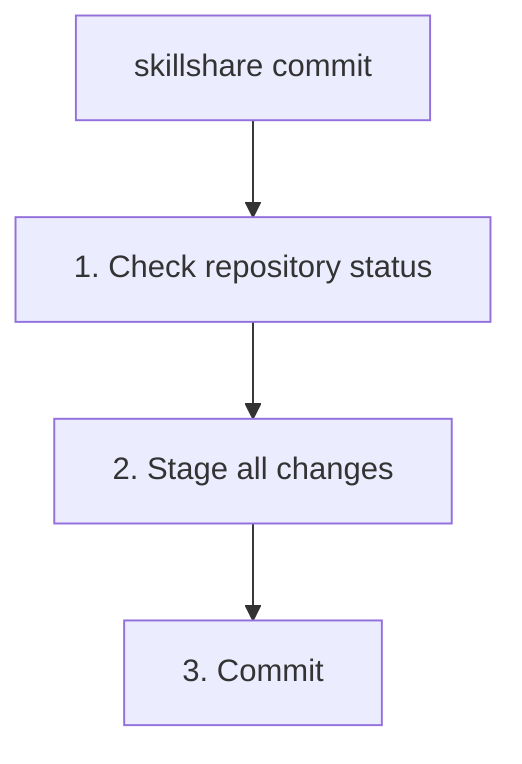

# commit

為 source skill 建立本機的 git commit，不會 push。

```bash
skillshare commit                         # 用預設訊息 commit
skillshare commit -m "Update skill"       # 自訂訊息
skillshare commit --dry-run               # 預覽
```

## When to Use

- 在實驗 skill 編輯之前，先儲存一個本機檢查點
- 在沒有設定 remote 的機器或 source repo 上 commit 變更
- 讓本機歷史紀錄與跨機器分享變更彼此獨立

如果你想 commit **並** push 到 git remote，請使用 [`push`](./push.md)。

## What Happens



`commit` 會 stage skill source 目錄中的所有變更，並建立一個 git commit。它不需要 remote，也絕不會執行 `git push`。

## Options

| Flag | Description |
|------|-------------|
| `-m, --message <msg>` | Commit 訊息（預設："Update skills"） |
| `--dry-run, -n` | 預覽而不做任何變更 |

## Git Root Scope {#git-root-scope}

`commit` 會對 `git_root` 設定欄位所選擇的目錄進行操作（預設為 `skills` 的 source）。使用 `skillshare init --git-root <scope>` 可以變更要進行版本控制的目錄。有效的 scope 如下：

| Scope | Directory |
|-------|-----------|
| `skills` (default) | Skills source（`~/.config/skillshare/skills/`） |
| `agents` | Agents source（`~/.config/skillshare/agents/`） |
| `extras` | Extras source（`~/.config/skillshare/extras/`） |
| `root` | Config root（`~/.config/skillshare/`）— 在同一個 repo 中對 skills + agents + extras 一併進行版本控制 |

如果 `git_root` 已變更，但 git repo 仍位於另一個 scope 的目錄中，`commit` 會印出「Git root mismatch」錯誤，並附上修正所需的確切 `git init` / `mv` 指令。請參閱 [Changing the scope after init](/docs/reference/targets/configuration#git-root)。

## Prerequisites

你的 skills source 目錄必須是一個 git repository：

```bash
skillshare init
```

如果 source 不是 git repository，`commit` 會印出設定提示並結束，不會變更任何檔案。

## Examples

```bash
# 用預設訊息 commit
skillshare commit

# 用自訂訊息 commit
skillshare commit -m "Update review skill"

# 預覽已 staged 的檔案與訊息，但不執行 commit
skillshare commit --dry-run
```

## See Also

- [push](./push.md) — Commit 並 push 到 git remote
- [pull](./pull.md) — 從 remote pull 並同步到 target
- [status](./status.md) — 檢查 git 與同步狀態
