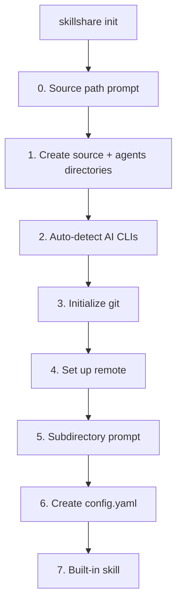
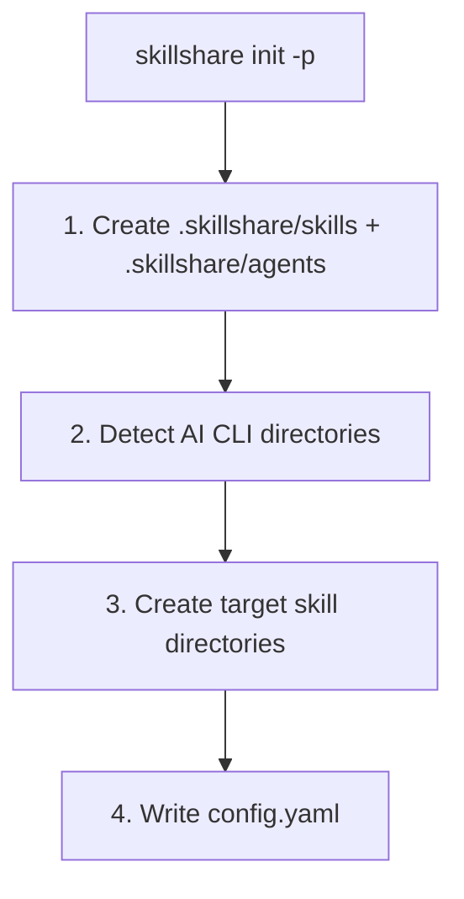

# init

第一次設定。自動偵測已安裝的 AI CLI 並設定 targets。

```bash
skillshare init              # 互動式設定
skillshare init --dry-run    # 預覽而不變更
```

## 何時使用

- 第一次在某台機器上設定 skillshare
- 遷移到新電腦（搭配 `--remote` 連接既有 repo）
- 把 skillshare 加入專案（搭配 `--project`）
- 發現新安裝的 AI CLI（搭配 `--discover`）

## 發生了什麼



`init` 會一次建立 skills source 目錄**與** `agents/` 同層目錄，讓兩種資源類型立即可用。agents 目錄是靜默建立的 — 沒有額外的提示或旗標。檔案格式請見 [Agents](/docs/understand/agents)。

:::info Universal target
偵測到任何 AI CLI 時，`init` 會自動推薦 **universal** target（`~/.agents/skills`）。這是 [vercel-labs/skills](https://github.com/vercel-labs/skills)（`npx skills list`）用來一次為所有相容 agents 提供 skills 的共用目錄。
:::

:::tip Agents source path
agents source 預設為 `<source parent>/agents`（預設安裝下即 `~/.config/skillshare/agents/`）。可在 `config.yaml` 中設定 `agents_source:` 來覆寫位置。Project mode 一律使用專案目錄內的 `agents/`，不會採用 `agents_source`。支援 agent 的 targets（Claude、Cursor、Augment、OpenCode）在你執行 `skillshare sync` 後會自動取得 agents。
:::

## Project Mode

以 `-p` 初始化專案層級的 skills：

```bash
skillshare init -p                              # 互動式
skillshare init -p --targets claude,cursor  # 非互動式
skillshare init -p --visible                    # 使用可見的 skillshare/ 目錄
```

### 發生了什麼



init 完成後，把專案目錄提交到 git（`skills/` 與 `agents/` 都要）。用 `--visible` 建立可見的 `skillshare/` 而非 `.skillshare/`。完整指南請見 [Project Setup](/docs/how-to/sharing/project-setup)。

## 探索模式

在既有設定上重新執行 init，以偵測並新增新的 AI CLI targets：

### Global

```bash
skillshare init --discover              # 互動式選擇
skillshare init --discover --select codex,opencode  # 非互動式
```

掃描尚未加入設定的新安裝 AI CLI 並提示你新增。只要偵測到任何 CLI，就會自動推薦 `universal` target（`~/.agents/skills`）。

### Project

```bash
skillshare init -p --discover           # 互動式選擇
skillshare init -p --discover --select antigravity  # 非互動式
```

掃描專案目錄中新的 AI CLI 目錄（例如 `.agents/`）並將其新增為 targets。

### Discover + Mode 行為

當你把 `--discover` 與 `--mode` 一起使用時，該 mode **只**套用到這次 discover 執行所新增的 targets。
設定檔中既有的 targets 不會被變更。

```bash
# 以 mode=copy 新增 cursor，不會變更既有的 targets
skillshare init --discover --select cursor --mode copy

# Project mode 變體（規則相同）
skillshare init -p --discover --select cursor --mode copy
```

:::tip
如果你在已初始化的設定上執行 `skillshare init`（未加 `--discover`），錯誤訊息會提示你使用它。
:::

## 選項

| 旗標 | 說明 |
|------|-------------|
| `--source, -s <path>` | 自訂 source 目錄（互動模式下若未設定會提示） |
| `--remote <url>` | 設定 git remote（隱含 `--git`；若 remote 已有 skills 會自動 pull；若 remote 已有 skills 則跳過內建 skill 提示） |
| `--project, -p` | 在目前目錄初始化專案層級的 skills |
| `--copy-from, -c <name\|path>` | 從特定 CLI 或路徑複製 skills |
| `--no-copy` | 以空的 source 開始（跳過複製提示） |
| `--targets, -t <list>` | 以逗號分隔的 target 名稱 |
| `--all-targets` | 新增所有偵測到的 targets |
| `--no-targets` | 跳過 target 選擇 |
| `--mode, -m <mode>` | 為新設定的 targets 設定預設 mode（`merge`、`copy`、`symlink`）。搭配 `--discover` 時，只影響新增的 targets。 |
| `--git` | 初始化 git 而不提示 |
| `--no-git` | 跳過 git 初始化 |
| `--skill` | 不提示，直接安裝內建的 skillshare skill（會把 `/skillshare` 加入 AI CLI） |
| `--no-skill` | 跳過內建 skill 安裝 |
| `--discover, -d` | 偵測並將新的 AI CLI targets 加入既有設定 |
| `--select <list>` | 以逗號分隔要新增的 targets（需搭配 `--discover`） |
| `--config local` | 將 `config.yaml` 加入 gitignore，讓每位開發者自行管理自己的 targets（僅限 project mode）。見 [Centralized Skills Repo](/docs/how-to/recipes/centralized-skills-repo) recipe。 |
| `--visible` | 建立可見的 `skillshare/` 專案目錄，而非 `.skillshare/`（僅限 project mode）。見 [Project Skills](/docs/understand/project-skills#visible-project-directory)。 |
| `--git-root <scope>` | `commit`/`push`/`pull` 操作的目錄範圍（預設 `skills`，另有 `agents`、`extras`、`root`）。`root` 會把 skills、agents、extras 一起放進同一個 repo 版控，並自動忽略 `config.yaml`。設定期間也會互動式詢問。之後可重新執行 `skillshare init --git-root <scope>` 以非互動方式切換範圍 — 它會在新範圍初始化 repo 並保存設定，但不會搬移既有歷史。 |
| `--subdir <name>` | 使用子目錄作為 source 路徑（例如 `skills`） |
| `--dry-run, -n` | 預覽而不實際變更 |

`init` 會設定你的初始 mode 策略。之後隨時可以針對個別 target 微調：

```bash
skillshare target cursor --mode copy
skillshare sync
```

## Source 子目錄

預設情況下，`init --remote` 會把整個 git repo 根目錄視為 skills source。如果你的 repo 也包含非 skill 檔案（README、CI 設定、dotfiles 等），可以改把 skills 存在子目錄中：

```
# 不加 --subdir：repo root = source（所有檔案都是 skills）
~/.config/skillshare/skills/          ← git repo root = source
  ├── my-skill/
  └── another-skill/

# 加 --subdir skills：source 指向一個子目錄
~/.config/skillshare/skills/          ← git repo root
  ├── README.md
  ├── .github/
  └── skills/                         ← source points here
      ├── my-skill/
      └── another-skill/
```

典型使用情境：把 skills 嵌入既有的 dotfiles 或 monorepo，而非用專屬的 skills-only repo。

```bash
# 互動式：init 期間會提示
skillshare init --remote git@github.com:you/dotfiles.git

# 非互動式：直接指定
skillshare init --remote git@github.com:you/dotfiles.git --subdir skills
```

## 常見情境

### Remote 設定（擇一）

互動式（建議用於想要引導提示的第一次設定）：

```bash
skillshare init --remote git@github.com:you/my-skills.git
```

非互動式（無提示，自動偵測已安裝的 targets）：

```bash
skillshare init --remote git@github.com:you/my-skills.git --no-copy --all-targets --no-skill
```

非互動式（無提示，並立即匯入既有的 Claude skills）：

```bash
skillshare init --remote git@github.com:you/my-skills.git --copy-from claude --all-targets --no-skill
```

### 集中式 skills repo

```bash
# 建立者：以本地設定建立共用 repo
skillshare init -p --config local --targets claude

# 團隊成員：clone 並自動偵測共用 repo
git clone <repo> && cd <repo>
skillshare init -p
skillshare target add myproject ~/DEV/myproject/.claude/skills -p
```

### 其他情境

```bash
# 標準設定（自動偵測所有東西）
skillshare init

# 使用既有的 skills 目錄
skillshare init --source ~/.config/skillshare/skills

# 專案層級設定
skillshare init -p
skillshare init -p --targets claude,cursor

# 完全非互動式設定
skillshare init --no-copy --all-targets --git --skill

# 以 copy mode 作為新增 targets 的預設值
skillshare init --mode copy

# 把新安裝的 CLI 加入既有設定
skillshare init --discover
skillshare init -p --discover

# 新增一個新發現的 target，並只對該 target 強制使用 copy mode
skillshare init --discover --select cursor --mode copy
```
