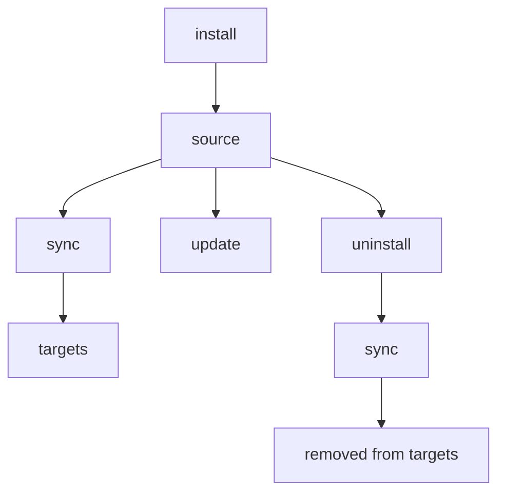

# install

從 GitHub repos、git URLs 或本地路徑新增 skills。

## 總覽



## 何時使用

- 從 GitHub、GitLab、Bitbucket、Azure DevOps 或本地路徑新增一個 skill
- 安裝組織共用的 skill repository（搭配 `--track`）
- 重新安裝或更新既有 skill（搭配 `--update` 或 `--force`）

---

## 快速範例

```bash
# 從 GitHub（簡寫）
skillshare install anthropics/skills/skills/pdf

# 瀏覽 repo 中可用的 skills
skillshare install anthropics/skills

# 從本地路徑
skillshare install ~/Downloads/my-skill

# 作為 tracked repo（用於團隊共享）
skillshare install github.com/team/skills --track

# 安裝到子目錄（依類別組織）
skillshare install ~/my-skill --into frontend

# 從設定檔安裝所有 skills（無參數）
skillshare install
```

## Source 格式

### GitHub 簡寫

使用 `owner/repo` 格式 — 會自動展開為 `github.com/owner/repo`：

```bash
skillshare install anthropics/skills                    # 瀏覽模式
skillshare install anthropics/skills/skills/pdf         # 直接安裝
skillshare install ComposioHQ/awesome-claude-skills     # 另一個 repo
```

### GitLab / Bitbucket / 其他主機

非 GitHub 主機請使用 `domain/owner/repo` 格式：

```bash
skillshare install gitlab.com/user/repo                 # GitLab
skillshare install bitbucket.org/team/skills            # Bitbucket
skillshare install git.company.com/team/skills          # 自架
```

完整 URL 與 SSH 也可以使用：

```bash
skillshare install https://gitlab.com/user/repo.git
skillshare install git@gitlab.com:user/repo.git
```

:::tip 在自訂網域上自架 GitLab
主機名稱包含 `gitlab` 或 `jihulab` 的會自動偵測，並支援巢狀 subgroup。對於在自訂網域上自架的其他 GitLab 實例（例如 `git.company.com`），請在設定檔的 [`gitlab_hosts`](/docs/reference/targets/configuration#gitlab_hosts) 中加入該主機名稱，讓 skillshare 把整個 URL 路徑當作 repository 處理。若未設定，可以加上 `.git` 作為權宜解法：`git.company.com/team/frontend/ui.git`。
:::

### Azure DevOps

使用 `ado:` 簡寫或完整的 Azure DevOps URL：

```bash
# 簡寫（ado:org/project/repo）
skillshare install ado:myorg/myproject/myrepo
skillshare install ado:myorg/myproject/myrepo/skills/react    # 含子目錄

# 完整 HTTPS URL
skillshare install https://dev.azure.com/myorg/myproject/_git/myrepo

# 舊版格式（自動正規化）
skillshare install https://myorg.visualstudio.com/myproject/_git/myrepo

# SSH
skillshare install git@ssh.dev.azure.com:v3/myorg/myproject/myrepo
```

## Discovery Mode（瀏覽 Skills）

當你未指定路徑時，skillshare 會 clone 該 repo、掃描其中的 skills，並顯示互動式選擇器：

```bash
skillshare install anthropics/skills
```

<p>
  
</p>

Discovery 會掃描所有目錄尋找 `SKILL.md` 檔案，只跳過 `.git`。這代表 `.curated/` 或 `.system/` 之類隱藏目錄中的 skills 也會被自動發現。當找到多個 skills 時，選擇提示會依目錄分組，方便瀏覽。

如果 repository 根目錄有 `.skillignore` 檔案，符合的 skills 會自動從 discovery 中排除。見下方 [.skillignore](#skillignore)。

如果某個 skill 的 `SKILL.md` 包含 `license:` frontmatter 欄位，該授權會顯示在選擇提示中（例如 `my-skill (MIT)`），單一 skill 安裝時也會顯示在確認畫面上。

**提示**：使用 `--dry-run` 可預覽而不實際安裝：
```bash
skillshare install anthropics/skills --dry-run
```

## Selective Install（非互動）

從多 skill 的 repo 中挑選特定 skills，不需要提示。`--skill` 旗標支援**模糊比對**與 **glob patterns** — 如果找不到完全相符的名稱，會先嘗試 glob 比對（`*`、`?`、`[...]`），再退回最接近的子字串比對：

```bash
# 依名稱安裝特定 skills（精確或模糊比對）
skillshare install anthropics/skills -s pdf,commit

# 安裝符合 glob pattern 的 skills
skillshare install anthropics/skills -s "core-*"

# 安裝所有發現的 skills
skillshare install anthropics/skills --all

# 自動接受（對多 skill repo 等同 --all）
skillshare install anthropics/skills -y

# 與其他旗標組合
skillshare install anthropics/skills -s pdf --dry-run
skillshare install anthropics/skills --all -p
```

Glob 比對不分大小寫：`"Core-*"` 會比對到 `core-auth`、`CORE-DB` 等。

:::tip Shell glob 保護
請務必為 glob patterns 加上引號（`"core-*"`），避免 shell 把 `*` 展開成目前目錄中的檔名。
:::

適用於 CI/CD pipelines 與腳本化的工作流程。

## Direct Install（指定路徑）

提供完整路徑以立即安裝：

```bash
# 含子目錄的 GitHub
skillshare install anthropics/skills/skills/pdf
skillshare install google-gemini/gemini-cli/packages/core/src/skills/builtin/skill-creator

# 模糊子目錄 — 若精確路徑不存在，依 skill 名稱比對
skillshare install runkids/my-skills/vue-best-practices

# 完整 URL
skillshare install github.com/user/repo/path/to/skill

# SSH URL
skillshare install git@github.com:user/repo.git

# 含子目錄的 SSH URL（使用 // 分隔）
skillshare install git@github.com:user/repo.git//path/to/skill

# 本地路徑
skillshare install ~/Downloads/my-skill
skillshare install /absolute/path/to/skill
```

:::tip 模糊子目錄解析
指定像 `owner/repo/skill-name` 這樣的子目錄路徑時，如果該 repo 中沒有完全相符的路徑，skillshare 會掃描所有 `SKILL.md` 檔案，並依目錄基礎名稱比對。如果有多個 skills 共用同一個名稱，會顯示含完整路徑的模糊錯誤，讓你指定確切的那一個。
:::

## Install from Config（無參數）{#install-from-config-no-arguments}

在不帶 source 參數的情況下執行時，`skillshare install` 會讀取記錄的 remote skill metadata（global mode）或專案的 `skills:` manifest（project mode），並安裝所有本地尚不存在的 remote skills：

```bash
# Global — 讀取 ~/.config/skillshare/config.yaml
skillshare install

# Project — 讀取 .skillshare/config.yaml
skillshare install -p
```

這讓記錄的 metadata/manifest 成為**可攜的 skill 設定** — 分享它就能在任何機器上重現相同的 skills：

```bash
# 新機器設定
skillshare install       # 從 metadata 復原 remote skills 與 tracked repos
skillshare sync          # 同步到 targets

# 新團隊成員導入
git clone github.com/team/project && cd project
skillshare install -p    # 從專案設定安裝所有 remote skills
skillshare sync
```

標記 `tracked: true` 的 skills 會以完整 git 歷史 clone（與 `--track` 相同），讓 `skillshare update` 可以正常運作。磁碟上已存在的 skills 會被跳過。當 tracked repo 目錄被 gitignore 而在本地遺失時，這是在全新 clone 後用來復原的指令。

:::tip push/pull 與 install from config 的差異
`push`/`pull` 會透過 git 同步實際的 skill **檔案**。`install`（從 config）則是從 **source URLs** 重新下載。兩者是互補的 — 何時該用哪個，見 [Cross-Machine Sync](/docs/how-to/sharing/cross-machine-sync#alternative-install-from-config)。
:::

使用無參數 install 時，不支援 `--name`、`--into`、`--track`、`--skill`、`--exclude`、`--all`、`--yes` 與 `--update`（它們都需要 source 參數）。`--dry-run`、`--force`、`--skip-audit` 以及門檻覆寫（`--audit-threshold` / `--threshold` / `-T`）則能正常運作。

## Project Mode

把 skills 安裝到專案的 `.skillshare/skills/` 目錄：

```bash
# 把一個 skill 安裝進專案
skillshare install anthropics/skills/skills/pdf -p

# 安裝到專案內的子目錄
skillshare install anthropics/skills -s pdf --into tools -p
# → .skillshare/skills/tools/pdf/

# 從設定檔安裝所有 remote skills（給新團隊成員）
skillshare install -p
```

:::caution 不要把專案根目錄安裝進自己
在 project mode 中，若安裝的本地路徑解析後就是專案根目錄本身（例如 `skillshare install ./ -p`），該操作會被拒絕 — 把根目錄複製進它自己的 `.skillshare/skills/` 子樹會遞迴進入目的地。請改為指向特定的 skill 子目錄：

```bash
skillshare install ./my-skill -p
```

這個防護同時適用於 CLI 與 Web UI（[`skillshare ui`](./ui.md)）。
:::

### 差異之處

| | Global | Project (`-p`) |
|---|---|---|
| 目的地 | `~/.config/skillshare/skills/` | `.skillshare/skills/` |
| `--track` | 支援 | 支援 |
| 設定檔更新 | 自動協調 `config.yaml` 的 `skills:` | 自動協調 `.skillshare/config.yaml` 的 `skills:` |
| 無參數 install | 安裝設定檔中列出的所有 skills | 安裝設定檔中列出的所有 skills |

**Project mode 中的 tracked repos** 運作方式與 global 相同 — repo 會保留 `.git` 進行 clone，並加入 `.skillshare/.gitignore`（預設也會忽略 `.skillshare/logs/` 與 `.skillshare/trash/`）。`tracked: true` 旗標會自動記錄到 `.skillshare/config.yaml`：

```bash
skillshare install github.com/team/skills --track -p
skillshare sync
```

完整指南見 [Project Setup](/docs/how-to/sharing/project-setup)。

## 選項

| 旗標 | 縮寫 | 說明 |
|------|-------|-------------|
| `--name <name>` | | 只安裝一個 skill 時覆寫其安裝名稱 |
| `--into <dir>` | | 安裝到子目錄中（例如 `--into frontend` 或 `--into frontend/react`） |
| `--force` | `-f` | 覆蓋既有 skill；略過 audit 阻擋與跨路徑重複檢查 |
| `--update` | `-u` | 若已存在則更新（git pull 或重新安裝） |
| `--branch <name>` | `-b` | 要 clone 的 git branch（預設：remote 的預設分支） |
| `--track` | `-t` | 保留 tracked repos 的 `.git` |
| `--kind <skill\|agent>` | | 限制只安裝一種資源類型 |
| `--agent <names>` | `-a` | 從 repo 中選擇特定 agents（以逗號分隔） |
| `--skill` | `-s` | 從多 skill repo 中選擇特定 skills（以逗號分隔；支援 glob patterns，如 `core-*`） |
| `--exclude` | | 安裝時跳過特定 skills（以逗號分隔；支援 glob patterns，如 `test-*`） |
| `--all` | | 安裝所有發現的 skills，不進行提示 |
| `--yes` | `-y` | 自動接受所有提示（適合 CI/CD） |
| `--skip-audit` | | 為此次安裝跳過安全 audit |
| `--audit-threshold <t>`, `--threshold <t>` | `-T` | 為此指令覆寫 audit 阻擋門檻（`critical\|high\|medium\|low\|info`；簡寫：`c\|h\|m\|l\|i`，另有 `crit`、`med`） |
| `--audit-verbose` | | 顯示每個 skill 完整的 audit 結果（預設：精簡摘要） |
| `--project` | `-p` | 安裝到專案的 `.skillshare/skills/` |
| `--global` | `-g` | 安裝到全域的 `~/.config/skillshare/skills/` |
| `--dry-run` | `-n` | 只預覽 |
| `--json` | | 以 JSON 輸出（隱含 `--force`；若未指定 `--skill`/`--agent` 篩選，也隱含非互動式選擇） |

## JSON 輸出

```bash
skillshare install anthropics/skills --json
```

```json
{
  "source": "anthropics/skills",
  "tracked": false,
  "dry_run": false,
  "skills": ["pdf", "commit", "review"],
  "failed": [],
  "duration": "2.345s"
}
```

使用 `--into` 時，會包含 `into` 欄位：

```bash
skillshare install anthropics/skills --json --into frontend
```

```json
{
  "source": "anthropics/skills",
  "tracked": false,
  "dry_run": false,
  "into": "frontend",
  "skills": ["pdf", "commit"],
  "failed": [],
  "duration": "1.890s"
}
```

對於僅安裝 agent 的情況，JSON 輸出仍會用 `skills` 陣列來回報已安裝的名稱：

```bash
skillshare install github.com/user/agents --kind agent --json
```

```json
{
  "source": "github.com/user/agents",
  "tracked": false,
  "dry_run": false,
  "skills": ["reviewer", "tutor"],
  "failed": [],
  "duration": "1.234s"
}
```

## 重複偵測

skillshare 會自動偵測你即將安裝的東西是否已經存在：

### 同一 repo 重新安裝

如果某個 skill 已存在，且是從**同一個 repo** 安裝的，skillshare 會以警告跳過它，而不是回報失敗：

```bash
skillshare install anthropics/skills/skills/pdf
# ✓ Installed pdf

skillshare install anthropics/skills/skills/pdf
# ⊘ pdf — already installed from same repo
```

用 `--update` 更新，或用 `--force` 覆蓋。

### 跨路徑重複

如果某個 repo 已安裝在某個位置，而你嘗試把它安裝到**不同**位置，skillshare 會阻擋這個操作：

```bash
# 第一次安裝（安裝到子目錄）
skillshare install runkids/feature-radar --into feature-radar

# 之後，忘記了第一次安裝
skillshare install runkids/feature-radar
# ✗ this repo is already installed at skills/feature-radar/scan (and 2 more)
#   Use 'skillshare update' to refresh, or reinstall with --force to allow duplicates
```

這可以防止在不同路徑間發生意外重複。若要有意允許，請用 `--force`。

### 與不同 repo 衝突

如果目的地目錄已存在，但是從**不同**的 repo 安裝的，錯誤訊息會包含原本的來源：

```bash
skillshare install owner/repo-b --name my-skill
# ✗ my-skill already exists (installed from https://github.com/owner/repo-a.git).
#   To overwrite: skillshare install owner/repo-b --name my-skill --force
```

`--force` 提示訊息一律會包含正確的旗標組合（包括適用時的 `--into`）。

## 常見情境

**以自訂名稱安裝：**
```bash
skillshare install google-gemini/gemini-cli/.../skill-creator --name my-creator
# 安裝為：~/.config/skillshare/skills/my-creator/
```

`--name` 只在 install 解析出單一 skill 時才有效。
在 `--track` 模式下，自訂名稱會以 tracked repo 目錄儲存（自動加上 `_` 前綴），且不得包含路徑分隔符或 `..`。

```bash
# ✅ 單一 skill（可行）
skillshare install comeonzhj/Auto-Redbook-Skills --name haha

# ❌ 多個發現的 skills（會出錯）
skillshare install anthropics/skills --name my-skill
```

**強制覆蓋既有項目：**
```bash
skillshare install ~/my-skill --force
```

**更新既有 skill：**
```bash
# 依 skill 名稱（使用已儲存的來源）
skillshare install pdf --update

# 依 source URL
skillshare install anthropics/skills/skills/pdf --update
```

**安裝到子目錄：**
```bash
# 依類別組織
skillshare install ~/my-skill --into frontend
# → ~/.config/skillshare/skills/frontend/my-skill/

# 多層巢狀
skillshare install anthropics/skills -s pdf --into frontend/react
# → ~/.config/skillshare/skills/frontend/react/pdf/

# sync 之後，target 會顯示扁平化名稱：frontend__my-skill、frontend__react__pdf
```

資料夾策略見 [Organizing Skills](/docs/how-to/daily-tasks/organizing-skills)。

**從特定分支安裝：**
```bash
# 從分支一般安裝
skillshare install github.com/team/skills --branch develop --all

# Track 特定分支
skillshare install github.com/team/skills --track --branch frontend

# 同一 repo、不同分支（用 --name 避免衝突）
skillshare install github.com/team/skills --track --branch frontend --name team-frontend
skillshare install github.com/team/skills --track --branch backend --name team-backend
```

**安裝團隊 repo（tracked）：**
```bash
skillshare install anthropics/skills --track
```

<p>
  
</p>

## 私有 Repositories {#private-repositories}

### SSH（建議）

SSH 是最簡單的方式 — 只要你的 SSH key 已設定好，就能直接運作：

```bash
skillshare install git@github.com:org/private-skills.git --track
skillshare install git@gitlab.com:org/skills.git --track
skillshare install git@bitbucket.org:team/skills.git --track
skillshare install git@ssh.dev.azure.com:v3/org/project/skills --track

# 含子目錄
skillshare install git@github.com:org/skills.git//frontend-react
```

### 帶 Token 的 HTTPS

設定對應的環境變數並使用一般的 HTTPS URL。skillshare 會自動偵測 token 並在 clone 時注入：

```bash
export GITHUB_TOKEN=ghp_your_token
skillshare install https://github.com/org/private-skills.git --track
```

| 平台 | 環境變數 | Token 類型 |
|----------|---------|------------|
| GitHub | `GITHUB_TOKEN` | Personal access token（`repo` scope） |
| GitLab | `GITLAB_TOKEN` | Personal access 或 CI job token |
| Bitbucket | `BITBUCKET_TOKEN` | Repository token，或 app password（搭配 `BITBUCKET_USERNAME`） |
| Azure DevOps | `AZURE_DEVOPS_TOKEN` | Personal Access Token（Code: Read scope） |
| 任何主機 | `SKILLSHARE_GIT_TOKEN` | 通用後備方案 |

平台專屬的變數優先於 `SKILLSHARE_GIT_TOKEN`。

官方 token 文件：
- GitHub：[Managing your personal access tokens](https://docs.github.com/en/authentication/keeping-your-account-and-data-secure/managing-your-personal-access-tokens)
- GitLab：[Token overview](https://docs.gitlab.com/security/tokens/)
- Bitbucket：[Access tokens](https://support.atlassian.com/bitbucket-cloud/docs/access-tokens/)
- Azure DevOps：[Use Personal Access Tokens](https://learn.microsoft.com/en-us/azure/devops/organizations/accounts/use-personal-access-tokens-to-authenticate?view=azure-devops)

若使用 Bitbucket app password，也要設定你的使用者名稱：

```bash
export BITBUCKET_USERNAME=your_bitbucket_username
export BITBUCKET_TOKEN=your_app_password
skillshare install https://bitbucket.org/team/skills.git --track
```

### CI/CD 範例

**GitHub Actions：**

```yaml
- name: Install shared skills
  env:
    GITHUB_TOKEN: ${{ secrets.GITHUB_TOKEN }}
  run: skillshare install https://github.com/org/skills.git --track
```

**GitLab CI：**

```yaml
install-skills:
  script:
    - skillshare install https://gitlab.com/org/skills.git --track
  variables:
    GITLAB_TOKEN: $CI_JOB_TOKEN
```

**Bitbucket Pipelines：**

```yaml
- step:
    name: Install shared skills
    script:
      - skillshare install https://bitbucket.org/team/skills.git --track
    env:
      BITBUCKET_USERNAME: $BITBUCKET_USERNAME   # for app passwords
      BITBUCKET_TOKEN: $BITBUCKET_TOKEN
```

**Azure Pipelines：**

```yaml
- script: skillshare install https://dev.azure.com/org/project/_git/skills --track
  env:
    AZURE_DEVOPS_TOKEN: $(System.AccessToken)
```

## 安全性掃描

每個 skill 在安裝時都會自動掃描安全威脅：

- 達到或超過 `audit.block_threshold` 的發現會**阻擋安裝**（預設：`CRITICAL`）
- 較低等級的發現會以警告顯示，並包含風險分數的說明
- `audit.block_threshold` 只控制阻擋等級；它**不會**停用掃描
- 沒有設定開關能永久跳過 audit；需要時請針對單次指令使用 `--skip-audit`
- 你可以用 `--audit-threshold`、`--threshold` 或 `-T` 針對單次指令覆寫門檻

門檻設定範例：

```yaml
audit:
  block_threshold: HIGH
```

```bash
# 被阻擋 — 偵測到 critical 威脅
skillshare install evil-skill
# → Installation blocked at active threshold. Use --force to override.

# 儘管有警告仍強制安裝
skillshare install suspicious-skill --force

# 完全跳過掃描（請謹慎使用）
skillshare install suspicious-skill --skip-audit

# 逐指令覆寫門檻（意思相同）
skillshare install suspicious-skill --audit-threshold high
skillshare install suspicious-skill --threshold high
skillshare install suspicious-skill -T h
```

用 `--force` 覆寫阻擋決定，或用 `--skip-audit` 完全略過掃描。掃描細節見 [audit](/docs/reference/commands/audit)。

Install 的決定使用**發現的嚴重程度 vs 門檻**。風險分數／標籤僅作為情境參考，本身不會阻擋安裝。預設情況下，audit 的發現會以精簡摘要顯示（依嚴重程度與訊息分組）。用 `--audit-verbose` 可查看完整清單。

### Tracked Repo Audit Gate（`--track`）

Tracked repos 使用相同的門檻模型，但掃描範圍與失敗處理更嚴格：

- 全新的 `--track` 安裝會掃描**整個 clone 的 repository**（而不只是一個 skill 資料夾）
- 達到或超過門檻的發現會阻擋安裝，除非使用 `--force`
- 若全新安裝被阻擋，skillshare 會自動從 source 中移除已 clone 的 repo
- 若自動清理失敗，install 會回傳明確錯誤，並告知你需要手動移除該路徑

透過 install 更新的 tracked repo（`skillshare install <repo> --track --update`）會在 `git pull` 之後進行 audit：

- skillshare 會先擷取 pull 前的 commit hash
- 若擷取 hash 失敗，更新會立即中止（fail-closed）
- 若偵測到達到或超過門檻的發現，更新會回滾到 pull 前的 commit
- 若回滾失敗，指令會以警告結束，提示可能仍殘留惡意內容

### `--force` vs `--skip-audit`

兩者都能解除安裝阻擋，但作用不同：

| 旗標 | Audit 執行狀況 | 發生什麼事 |
|------|------------------|--------------|
| `--force` | Audit 仍會執行 | 發現仍會產生／記錄；即使達到門檻，安裝仍會繼續 |
| `--skip-audit` | Audit 被跳過 | 這次安裝完全不執行掃描 |

建議用法：

- 若你仍想看到掃描發現，優先使用 `--force`。
- 只有在你確實需要略過掃描時才使用 `--skip-audit`。
- 如果兩者同時設定，實務上 `--skip-audit` 優先（掃描會被跳過）。

## 排除 Skills {#excluding-skills}

### `--exclude` 旗標

從多 skill repo 安裝時跳過特定 skills。同時支援精確名稱與 **glob patterns**：

```bash
# 安裝除了特定 skills 以外的全部
skillshare install anthropics/skills --all --exclude cli-sentry,delayed-command

# 用 glob pattern 排除
skillshare install anthropics/skills --all --exclude "test-*"

# 也適用於 -y
skillshare install org/skills -y --exclude internal-tool

# 與 --skill 組合做精細控制
skillshare install org/skills -s pdf,commit,docs --exclude docs
```

排除 skills 時，會顯示訊息說明跳過了哪些：`Excluded 2 skill(s): cli-sentry, delayed-command`。

:::note 需要多 skill discovery
`--exclude` 只在從包含多個 skills 的 **git repo** 安裝時才有效。它可以搭配 `--all`、`--yes`、`--skill` 以及互動式選擇模式使用。對於直接安裝（本地路徑或單一 skill 的 git URL），`--exclude` 不適用 — 若指定了會顯示警告。
:::

### .skillignore {#skillignore}

Repository 維護者可以在 repo 根目錄建立 `.skillignore` 檔案，把 skills 從 discovery 中隱藏。從該 repo 安裝的使用者永遠不會在選擇提示中看到這些 skills。

```text title=".skillignore"
# Internal tooling — not for public use
validation-scripts
scaffold-template

# Exclude all test/eval skills
prompt-eval-*

# Exclude an entire group directory
internal-tools
```

**實際案例** — [`runkids/my-skills`](https://github.com/runkids/my-skills) 使用 `.skillignore` 排除非 skill 目錄與內部工具：

```text title=".skillignore"
skillshare
feature-radar
```

搭配 `--exclude`，使用者可以進一步縮小選擇範圍：

```bash
skillshare install runkids/my-skills --exclude seo
```

**格式** — 使用 [gitignore 語法](https://git-scm.com/docs/gitignore)：

| Pattern | 範例 | 行為 |
|---------|---------|----------|
| 精確名稱 | `validation-scripts` | 比對該路徑的 skill |
| 群組比對 | `feature-radar` | 比對 `feature-radar/` 下的**所有** skills |
| 精確路徑 | `feature-radar/feature-radar` | 只比對該特定 skill |
| `*` 萬用字元 | `prompt-eval-*` | 比對單一片段（不會跨越 `/`） |
| `**` | `**/temp` | 比對任意目錄深度 |
| `?` | `?.md` | 比對單一字元 |
| `[abc]` | `[Tt]est` | 字元類別 |
| `!pattern` | `!important` | 否定 — 取消先前已比對到的 skill |
| `/pattern` | `/root-only` | 錨定於 `.skillignore` 所在位置 |
| `pattern/` | `build/` | 僅比對目錄 |
| `\#`、`\!` | `\#file` | 轉義的字面字元 |

以 `#` 開頭的行是註解。空白行會被忽略。

**建議使用情境：**
- 發布多 skill repository，同時隱藏內部工具或開發中的 skills
- 在 monorepo 中依群組組織 skill 目錄，並排除整個群組（例如 `internal-tools`）
- 強制維護者層級的可見性規則，讓所有安裝者永遠無法發現某些 skills

**不適用情境：**
- 直接安裝本地路徑（這些會跳過 discovery）
- 單一 skill 的直接安裝（與 `--exclude` 類似，直接安裝路徑會忽略它）

`.skillignore` 是在 git repo discovery 過程中套用的，因此會影響所有基於 discovery 的安裝路徑：`--all`、`--skill`、`--yes` 與互動式選擇。它**不會**套用到直接的本地路徑安裝（這些完全跳過 discovery）。

:::tip .skillignore 的作用範圍
**Repo 層級**的 `.skillignore`（位於 repository 根目錄）控制使用者從你的 repo 安裝時，哪些 skills 是可被發現的。安裝後，tracked repos 會保留它們的 `.skillignore` — `doctor`、`status`、`list`、`sync`、`audit`、`diff` 與 `check` 也都會遵循它。

**Source 根層級**的 `.skillignore`（`~/.config/skillshare/skills/.skillignore`）會全域套用到所有 skills — 不論是否為 tracked。可用它暫時靜音某些 skills 或排除特定 pattern（例如 `draft-*`），而不需要解除安裝。
:::

### `.skillignore` vs `--exclude`

| | `.skillignore` | `--exclude` |
|---|---|---|
| **由誰控制** | Repo 維護者 | 安裝的使用者 |
| **存放位置** | repo 根目錄的 `.skillignore` | CLI 旗標 |
| **何時套用** | Discovery 期間（選擇之前） | Discovery 之後（提示之前） |
| **範圍** | 所有從此 repo 安裝的使用者 | 僅此次安裝 |
| **需求** | 有多個 skills 的 git repo | 有多個 skills 的 git repo |

## Agent 支援

安裝 repository 時，skillshare 會自動偵測 agents（獨立的 `.md` 檔案）與 skills 並存：

- 如果 repo 包含 `agents/` 目錄，其中的 `.md` 檔案會被發現為 agent 候選項
- 如果 repo 同時有 `skills/` 與 `agents/`，兩者都會被安裝
- 如果 repo 根目錄只有零散的 `.md` 檔案（沒有 `SKILL.md`），會被視為 agents

### 明確的 agent 旗標

```bash
# 只從 repo 安裝 agents
skillshare install github.com/user/repo --kind agent

# 依名稱安裝特定 agents（-a 簡寫）
skillshare install github.com/user/repo -a tutor,reviewer

# 與 project mode 組合
skillshare install github.com/user/repo --kind agent -p
```

`-a <name>` 旗標是 skills 中 `-s <name>` 的 agent 對應版本。Agents 會安裝到 `~/.config/skillshare/agents/`（global）或 `.skillshare/agents/`（project）。完整概念見 [Agents](/docs/understand/agents)。

### 在混合 repo 中界定 skills 與 agents 的範圍

當 repo 同時包含 skills 與 agents 時，篩選旗標會精確控制安裝的內容：

| 旗標 | 安裝的內容 |
|-------|---------------------|
| _(無)_ | 所有 skills 與所有 agents |
| `--all` / `--yes` | 所有 skills 與所有 agents |
| `-s <names>` | 只有指定的 skills — **不含 agents** |
| `-s <names> -a <names>` | 指定的 skills 與指定的 agents |
| `-a <names>` | 只有指定的 agents |

```bash
# 從混合 repo 只安裝一個 skill — 不會拉入 agents
skillshare install github.com/user/repo -s pdf

# 一起安裝一個 skill 與一個 agent
skillshare install github.com/user/repo -s pdf -a tutor
```

未知的 `-a` 名稱會在一開始就讓整個指令失敗 — 在任何 skill 被安裝之前 — 因此自動化流程永遠不會看到安裝到一半的狀態。

## 安裝之後

務必執行 sync 以分發到 targets：

```bash
skillshare install anthropics/skills/skills/pdf
skillshare sync  # ← 別忘了！
```

## 另見

- [list](/docs/reference/commands/list) — 查看已安裝的 skills
- [update](/docs/reference/commands/update) — 更新 skills 或 tracked repos
- [upgrade](/docs/reference/commands/upgrade) — 升級 CLI 與內建 skill
- [uninstall](/docs/reference/commands/uninstall) — 移除 skills
- [sync](/docs/reference/commands/sync) — 把 skills 同步到 targets
- [Organization-Wide Skills](/docs/how-to/sharing/organization-sharing) — 用 tracked repos 進行組織共享
