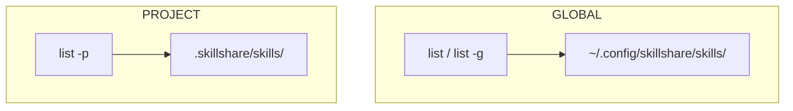
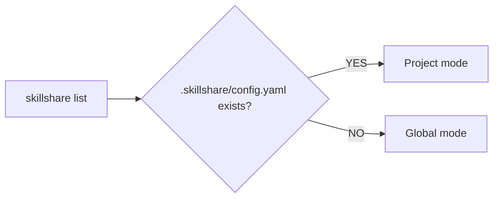

# list

列出 source 目錄中所有已安裝的 skills。

```bash
skillshare list              # 互動式 TUI（TTY 下的預設值）
skillshare list --verbose    # 詳細的純文字檢視
skillshare list --json       # 供 CI/腳本使用的 JSON 輸出
```

## 何時使用

- 查看已安裝哪些 skills 以及它們的來源
- 互動式搜尋與篩選 skills
- 檢查哪些 skills 是 tracked repos、哪些是 local
- 在清理前稽核你的 skill 收藏


## 互動式 TUI

在 TTY 中，`skillshare list` 會啟動一個互動式終端機 UI，具備：

- **智慧篩選** — 按 `/` 依名稱、路徑或來源篩選。支援 tag 語法做精準篩選：

  | Tag | 縮寫 | 值 | 範例 |
  |-----|-------|--------|---------|
  | `type:` | `t:` | `tracked`、`remote`、`local`、`github` | `t:tracked` |
  | `group:` | `g:` | 任意目錄名稱 | `g:security` |
  | `repo:` | `r:` | 任意 repo 名稱 | `r:team` |
  | `kind:` | `k:` | `skill`、`agent` | `k:agent` |
  | `status:` | `s:` | `enabled`、`disabled` | `s:disabled` |

  Tags 可以與純文字組合（AND 邏輯）：
  ```
  t:tracked g:security audit
  ```
  這會只顯示「security」群組中、名稱包含「audit」的 tracked skills。

  :::tip
  要篩選啟用/停用狀態，通常不需要用 tag — 直接按 `s`
  （見下方**狀態篩選**）。`s:enabled` / `s:disabled` tag 是用來把
  status 與其他 tags *組合*使用的，例如 `t:tracked s:disabled`。
  :::

- **狀態篩選** — 按 `s` 循環切換啟用/停用檢視：**全部 → 已啟用 → 已停用 → 全部**。目前狀態會以 `Status:` chip 顯示在分頁列旁邊，因此在很長的清單中，你可以立即縮小範圍到只看透過 `.skillignore` 停用的 skills（或隱藏它們）。可與分頁及 `/` 篩選組合使用。
- **鍵盤導覽** — 方向鍵瀏覽，`q` 離開
- **詳細面板** — 顯示選取 skill 的描述、磁碟路徑、檔案與已同步的 targets
- **啟用/停用切換** — 按 `E` 切換選取 skill 的啟用/停用狀態。會立即寫入 `.skillignore`，不需離開 TUI。已停用的 skills 會在詳細面板顯示紅色的 **disabled** 徽章。
- **僅手動切換** — 按 `M` 切換選取 skill `SKILL.md` 中的 `disable-model-invocation`。該 skill 仍保持已安裝，你仍可用名稱呼叫它，但模型不會再自動載入它；詳細面板會顯示 **manual only** 徽章。與 `E` 不同，這會編輯 skill 檔案本身：對於 tracked 或已安裝的 skill，TUI 會先詢問，因為 `skillshare update` 會跳過有本地變更的 tracked repos，而重新安裝 skill 會丟失這項編輯。再按一次 `M` 會移除該行並完整還原檔案。Agents 不受影響。[dashboard](/docs/reference/commands/ui) 顯示相同的 **manual only** 標籤，並在其 skill 編輯器中提供切換開關。
- **內容檢視器** — 按 `Enter` 開啟雙欄檢視器，左側是檔案樹、右側是以 Markdown 渲染的內容。`j`/`k` 瀏覽檔案（自動預覽），`l`/`Enter` 展開目錄，`h` 收合。`Ctrl+d`/`u` 內容半頁捲動，`g`/`G` 跳到頂部/底部。也支援滑鼠滾輪與點擊。

使用 `--no-tui` 跳過 TUI，改印出純文字：

```bash
skillshare list --no-tui          # 純文字輸出
skillshare list --no-tui | less   # 手動 pipe 到 pager
```

## 搜尋與篩選

不進入 TUI 也能篩選 skills：

```bash
skillshare list react                     # 依名稱/路徑/來源篩選
skillshare list --type local              # 只顯示 local skills
skillshare list --type github             # 只顯示 GitHub 來源的 skills
skillshare list --status disabled         # 只顯示透過 .skillignore 停用的 skills
skillshare list --status enabled --json   # 已啟用的 skills，以 JSON 輸出
skillshare list react --sort newest       # 依安裝日期排序
skillshare list --json | jq '.[].name'   # 供腳本使用的 JSON
```

預設檢視（`--status all`）包含標記為停用的項目。`--status`
會與 pattern 及 `--type` 以 AND 邏輯組合，在 project mode
以及 `list agents` / `list --all` 中都能運作，並會決定 TUI `Status:` chip
的初始狀態（你仍可從那裡按 `s` 循環切換）。

:::tip AI Usage
以程式化方式檢查 skills 時，使用 `--json` 模式：
```bash
skillshare list --json | jq '.[] | {name, source, type}'
```
:::

## 輸出範例

### 精簡檢視

當你用資料夾組織 skills 時，會自動依目錄分組：

```
Installed skills
─────────────────────────────────────────

  frontend/
    → react-helper        github.com/user/skills
    → vue-helper          github.com/user/skills

  → my-skill              local
  → commit-commands       github.com/user/skills
  → old-draft             local  [disabled]

Tracked repositories
─────────────────────────────────────────
  ✓ _team-skills          3 skills, up-to-date
```

如果所有 skills 都在最上層（沒有資料夾），輸出會是平面清單 — 與先前版本相同。

### 詳細檢視

```bash
skillshare list --verbose
```

```
Installed skills
─────────────────────────────────────────

  frontend/
    react-helper
      Source:      github.com/user/skills
      Type:        github
      Installed:   2026-01-15

    vue-helper
      Source:      github.com/user/skills
      Type:        github
      Installed:   2026-01-15

  my-skill
    Source:      (local - no metadata)

  commit-commands
    Source:      github.com/user/skills
    Type:        github
    Installed:   2026-01-15

Tracked repositories
─────────────────────────────────────────
  ✓ _team-skills          3 skills, up-to-date
  ! _other-repo           5 skills, has changes
```

## Global vs Project

skillshare 在兩個層級運作。`list` 指令會顯示目前作用層級的 skills：



| | Global | Project |
|---|---|---|
| **Source** | `~/.config/skillshare/skills/` | `.skillshare/skills/` |
| **旗標** | `-g` 或預設 | `-p` 或自動偵測 |
| **範圍** | 機器上所有專案 | 單一 repository |
| **共享方式** | `push` / `pull` | git commit |

### 自動偵測

當你不加旗標執行 `skillshare list` 時，skillshare 會自動偵測 mode：



```bash
cd my-project/            # 有 .skillshare/config.yaml
skillshare list           # → Installed skills（project）

cd ~
skillshare list           # → Installed skills（global）
```

使用 `-p` 或 `-g` 覆寫自動偵測：

```bash
skillshare list -g        # 強制 global，即使在專案內也一樣
skillshare list -p        # 強制 project，即使沒有自動偵測
```

## Project Mode

```bash
skillshare list          # 若 .skillshare/ 存在則自動偵測
skillshare list -p       # 明確指定 project mode
```

### 輸出範例

```
Installed skills (project)
─────────────────────────────────────────

  tools/
    → pdf               anthropic/skills/pdf
    → review            github.com/team/tools

  → my-skill            local

→ 3 skill(s): 2 remote, 1 local
```

Project list 使用與 global list 相同的視覺格式，標題會加上 `(project)` 標籤。Skills 依目錄分組，並依有無 metadata 分類為 `local`（無 metadata）或依來源 URL 分類（remote）。

## 選項

| 旗標 | 說明 |
|------|-------------|
| `[pattern]` | 依名稱、路徑或來源篩選 skills（不分大小寫） |
| `--verbose, -v` | 顯示詳細資訊（來源、類型、安裝日期） |
| `--json, -j` | 以 JSON 輸出（適用於 CI/腳本） |
| `--no-tui` | 停用互動式 TUI，改用純文字輸出 |
| `--type, -t <type>` | 依類型篩選：`tracked`、`local`、`github` |
| `--status <status>` | 依狀態篩選：`all`（預設）、`enabled`、`disabled` |
| `--sort, -s <order>` | 排序方式：`name`（預設）、`newest`、`oldest` |
| `--project, -p` | 列出專案 skills |
| `--global, -g` | 列出全域 skills |
| `--help, -h` | 顯示說明 |

## 目錄分組

當 skills 透過資料夾組織（[`--into`](/docs/reference/commands/install) 安裝時，或手動 `mv` + `sync`）時，`list` 會自動依目錄分組：

```
  frontend/
    → react-helper        github.com/user/skills
    → vue-helper          github.com/user/skills

  → my-skill              local
```

- 同一資料夾下的 skills 共用一個群組標題（例如 `frontend/`）
- 每個群組內，只顯示基礎名稱（而非完整路徑）
- 頂層 skills（無父層資料夾）會以無群組方式顯示在最下方
- 如果**所有** skills 都在頂層，輸出會是平面清單 — 沒有群組標題

分組是根據你 source 目錄內的目錄結構，而非某個旗標。要開始使用，請用 `--into` 組織 skills：

```bash
skillshare install owner/repo -s react-patterns --into frontend
skillshare install owner/repo -s vue-patterns --into frontend
```

更多細節見 [Organizing Skills with Folders](/docs/how-to/daily-tasks/organizing-skills)。

## 理解輸出內容

### Skill 來源

| 標籤 | 意義 |
|-------|---------|
| `local` | 本地建立，沒有 metadata |
| `github.com/...` | 從 GitHub 安裝 |
| `tracked: <repo>` | 屬於某個 tracked repository |
| `[disabled]` | 透過 `.skillignore` 排除的 skill（見 [enable/disable](./enable.md)） |

### Repository 狀態

| 圖示 | 意義 |
|------|------|
| `✓` | 最新，沒有本地變更 |
| `!` | 有未提交的變更 |

## Agent 支援

`skillshare list agents` 會篩選成只顯示 agents，也就是 agents source 目錄（`~/.config/skillshare/agents/` 或 `.skillshare/agents/`）中的 `.md` 檔案。

```bash
skillshare list agents              # 只列出 agents
skillshare list agents --json       # agents 的 JSON 輸出
skillshare list agents --verbose    # 詳細的 agent 清單
```

在互動式 TUI 中，agents 會顯示 **[A]** 徽章以與 skills 區別。所有 TUI 功能（篩選、詳細面板、啟用/停用切換）運作方式相同。

不加 `agents` 參數時，`list` 只顯示 skills（預設行為）。背景說明見 [Agents](/docs/understand/agents)。

## 另見

- [enable / disable](/docs/reference/commands/enable) — 在不移除的情況下切換 skills
- [install](/docs/reference/commands/install) — 安裝 skills
- [uninstall](/docs/reference/commands/uninstall) — 移除 skills
- [status](/docs/reference/commands/status) — 顯示同步狀態
- [Agents](/docs/understand/agents) — Agent 概念
