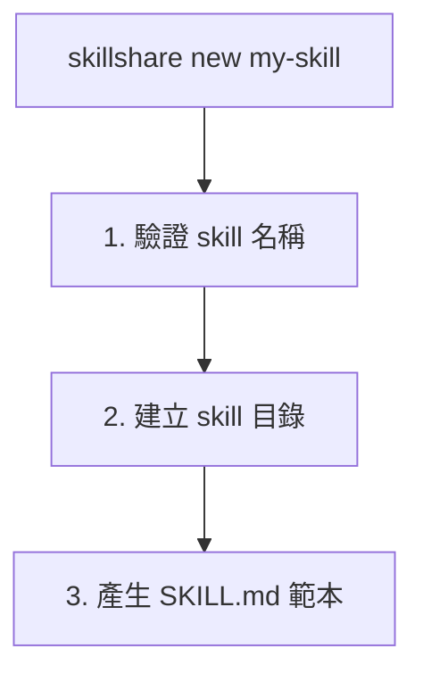

# new

建立一個帶有 SKILL.md 範本的新 skill。

```bash
skillshare new <name>            # 建立新 skill
skillshare new <name> -p         # 建立於 project（.skillshare/skills/）
skillshare new <name> --dry-run  # 預覽而不實際建立
```

## 使用時機

- 使用建議的範本結構從頭建立新 skill
- 以正確的 SKILL.md 格式（name、description、frontmatter）開始

**執行流程：**


---

## 選項

| Flag | 說明 |
|------|-------------|
| `--project`, `-p` | 建立於 project（`.skillshare/skills/`） |
| `--global`, `-g` | 建立於 global（`~/.config/skillshare/skills/`） |
| `--pattern`, `-P` | 使用設計模式（`tool-wrapper`、`generator`、`reviewer`、`inversion`、`pipeline`、`none`） |
| `--dry-run`, `-n` | 預覽而不建立檔案 |
| `--help`, `-h` | 顯示說明 |

自動偵測：若目前目錄存在 `.skillshare/config.yaml`，預設使用 project 模式。

---

## Skill 名稱規則

- 小寫字母、數字、連字號、底線
- 必須以字母或底線開頭
- 範例：`my-skill`、`code_review`、`pdf-tools`

---

## 範本結構

產生的 SKILL.md 遵循 [Anthropic 的 skill 建構最佳實務](https://www.anthropic.com/engineering/building-skills-for-claude)：

```markdown
---
name: my-skill
description: >-
  Describe what this skill does. Use when user asks to
  "trigger phrase 1", "trigger phrase 2", or needs help
  with a specific task.
# ── Optional fields ──────────────────────────────────
# license: MIT
# allowed-tools: "Bash(python:*) WebFetch"
# metadata:
#   author: Your Name
#   version: 1.0.0
---

# My Skill

Brief overview of what this skill does and its value.

## When to Use

Use this skill when the user:
- Asks to "specific trigger phrase"
- Mentions specific keywords or file types
- Needs help with a particular task

Do NOT use this skill for:
- Unrelated tasks (clarify scope boundaries)

## Instructions

### Step 1: Gather Context
### Step 2: Execute
### Step 3: Validate

## Examples

**Example:** Common scenario
User says: "Help me with <my-skill-related task>"

## Troubleshooting

**Error:** Common error message
**Cause:** Why it happens
**Solution:** How to fix it
```

### 關鍵設計考量

此範本遵循 Anthropic 的[三層漸進式揭露](https://www.anthropic.com/engineering/building-skills-for-claude)模型：

| 層級 | 內容 | 載入時機 |
|-------|------|-------------|
| **1. Frontmatter** | `name` + `description` | 一律載入（system prompt） |
| **2. SKILL.md 主體** | 完整指示 | 當該 skill 相關時 |
| **3. 連結檔案** | `references/`、`scripts/` | 依需求載入 |

**description 必須包含 WHAT + WHEN** — 這是最重要的欄位。Claude 靠它決定是否載入你的 skill。不好的範例：`"Helps with projects"`。好的範例：`"Manages sprint planning. Use when user says 'plan sprint' or 'create tickets'."`。更多範例請參閱 [Anthropic 的指南](https://www.anthropic.com/engineering/building-skills-for-claude)。

---

## 範例

### 建立簡單的 skill

```bash
skillshare new code-review
```

輸出：
```
New Skill Created
─────────────────────────────────────────────
✓ Created: ~/.config/skillshare/skills/code-review/SKILL.md

Next steps:
  1. Edit ~/.config/skillshare/skills/code-review/SKILL.md
  2. Run 'skillshare sync' to deploy
```

### 建立於 project 中

```bash
skillshare new code-review -p
```

輸出：
```
New Skill Created (project)
─────────────────────────────────────────────
✓ Created: .skillshare/skills/code-review/SKILL.md

Next steps:
  1. Edit .skillshare/skills/code-review/SKILL.md
  2. Run 'skillshare sync' to deploy
```

### 建立前先預覽

```bash
skillshare new my-skill --dry-run
```

輸出：
```
New Skill (dry-run)
─────────────────────────────────────────────
→ Would create: ~/.config/skillshare/skills/my-skill
→ Would write: ~/.config/skillshare/skills/my-skill/SKILL.md

Template preview:
─────────────────────────────────────────────
---
name: my-skill
description: >-
  Describe what this skill does. Use when user asks to ...
---
...
```

---

## Pattern 範本

使用 `-P` 產生帶有建議目錄結構的特定 pattern 範本：

```bash
skillshare new my-reviewer -P reviewer     # Reviewer pattern
skillshare new my-pipeline -P pipeline     # 含 references/、assets/、scripts/ 的 pipeline
skillshare new my-skill                    # 互動式 TUI 選擇
```

可用的 patterns：

| Pattern | 建構的目錄 |
|---------|---------------------|
| `tool-wrapper` | `references/` |
| `generator` | `assets/`、`references/` |
| `reviewer` | `references/` |
| `inversion` | `assets/` |
| `pipeline` | `references/`、`assets/`、`scripts/` |
| `none` | *(純範本，無目錄)* |

詳見 [Skill Design Patterns](/docs/understand/philosophy/skill-design-patterns) 了解各 pattern 的細節。

---

## Web UI 精靈

你也可以從 web dashboard 建立 skills — 不需要終端機。

1. 執行 `skillshare ui`
2. 進入 **Skills** → 點選 **"+ New Skill"**
3. 依照精靈步驟：

| 步驟 | 內容 |
|------|------|
| **Name** | 輸入 skill 名稱，即時驗證 |
| **Pattern** | 從 6 種設計模式中選擇（卡片網格） |
| **Category** | 選擇一個領域分類 — 若 pattern 為 `none` 則跳過 |
| **Scaffold** | 切換建議的目錄 — 若 pattern 沒有目錄則跳過 |
| **Confirm** | 檢視選擇並建立 |

精靈會跟隨目前的模式 — 若 dashboard 是以 project 模式（`-p`）執行，skill 會建立於 `.skillshare/skills/`。

---

## 後續步驟

建立 skill 之後：

1. **編輯 SKILL.md** — 先聚焦於 `description` 欄位（WHAT + WHEN）
2. **加入指示** — 使用清楚動作的步驟式格式
3. **同步至 targets** — `skillshare sync`
4. **測試觸發** — 詢問你的 AI CLI 相關問題，確認 skill 是否被載入
5. **迭代** — 根據觸發過多或過少的情況調整觸發詞

---

## 另請參閱

- [install](/docs/reference/commands/install) — 從儲存庫安裝 skills
- [sync](/docs/reference/commands/sync) — 將 skills 同步到 targets
- [Configuration](/docs/reference/targets/configuration) — 設定參考
