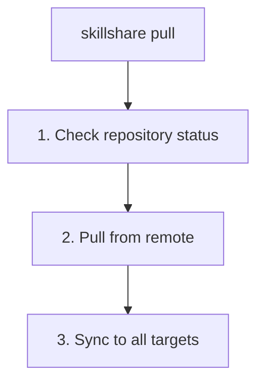

# pull

從 git remote 拉取並同步到所有 targets。

```bash
skillshare pull              # Pull and sync
skillshare pull --dry-run    # Preview
skillshare pull --force      # Replace local with remote on first pull
```

## 何時使用

- 從已推送變更的另一台機器同步 skills
- 取得其他人推送更新後的最新 skills
- 在 `init --remote` 之後於新機器上開始工作

## 執行流程



## 選項

| Flag | Description |
|------|-------------|
| `--dry-run, -n` | Preview without making changes |
| `--force, -f` | On first pull conflict, replace local skills with remote |

## Git Root 範圍

`pull` 會操作 `git_root` 設定欄位所選定的目錄（預設為 `skills` source）。範圍對照表參見 [commit — Git Root Scope](./commit.md#git-root-scope)。如果 `git_root` 已變更，但 git repo 仍存在於另一個 scope 的目錄下，`pull` 會印出「Git root mismatch」錯誤，並附上確切的 `git init` / `mv` 修正指令。參見 [init 之後變更 scope](/docs/reference/targets/configuration#git-root)。

拉取完成後，`pull` 會同步該 scope 所涵蓋的內容：`skills` 執行 `sync`，`agents` 執行 `sync agents`，`root` 兩者都執行，`extras` 執行 `sync extras`。

## 先決條件

你的 source 目錄必須是一個帶有 remote 的 git repository：

```bash
# Check if ready:
skillshare status
# Shows: Git: initialized with remote
```

## 本機變更警告

如果你有尚未 commit 的變更，`pull` 會失敗：

```bash
$ skillshare pull
Local changes detected
  Run: skillshare push
  Or:  cd ~/.config/skillshare/skills && git stash
```

解決方法：
```bash
# Option 1: Commit locally first, without pushing
skillshare commit -m "Local changes"
skillshare pull

# Option 2: Push your changes first
skillshare push
skillshare pull

# Option 3: Stash your changes
cd ~/.config/skillshare/skills
git stash
skillshare pull
git stash pop
```

## 兩台機器都有 Commit 時 {#when-both-machines-committed}

如果這台機器有 remote 沒有的 commits，而 remote 也有這台機器沒有的 commits，`pull` 會把兩邊的歷史合併成一個 merge commit，然後再同步。之後 push 就能把合併結果分享出去。

兩台機器每次安裝或更新 skill 時都會改寫 `.metadata.json`，所以這個檔案經常發生衝突。`pull` 會自動解決這些衝突：每個 skill 的條目分開合併，如果兩台機器改了同一個條目，以 `installed_at` 較新的一方為準。

其他檔案的衝突則會讓 pull 停止、復原 merge，並列出衝突的檔案：

```bash
$ skillshare pull
git pull failed
pull stopped: this machine and the remote both changed my-skill/SKILL.md; the merge was undone, resolve it with git in ~/.config/skillshare/skills
```

Repository 會維持 pull 之前的狀態。要自行解決衝突：

```bash
cd ~/.config/skillshare/skills
git pull --no-rebase             # redo the merge and keep the conflicts
# edit the conflicted files, then
git add . && git commit --no-edit
skillshare push
skillshare sync
```

## 首次 Pull 且已有現存 Skills

在第一次 pull（尚未設定 upstream）時，如果本機與 remote 都已經有 skill 目錄，
`pull` 會嘗試進行 **merge** 以合併雙方內容。如果 merge 成功，本機與 remote 的 skills 都會被保留。

如果發生 **merge 衝突**，`pull` 會失敗並回傳非零的 exit code：

```bash
$ skillshare pull
Pull failed
  Resolve manually: cd ~/.config/skillshare/skills && git merge --allow-unrelated-histories <remote branch>
  Or force-pull: skillshare pull --force  (replaces local with remote)
```

解決方式：

```bash
# Resolve conflicts manually, then push
cd ~/.config/skillshare/skills
git add . && git commit
skillshare push

# Or discard local and take remote
skillshare pull --force
```

## 範例

```bash
# Standard pull (most common)
skillshare pull

# Preview what would happen
skillshare pull --dry-run

# Replace local with remote on first-pull conflict
skillshare pull --force
```

## 工作流程

在次要機器上的典型工作流程：

```bash
# Start of day: get latest skills
skillshare pull

# ... work with AI tools ...

# End of day: share any new skills
skillshare collect claude    # If you created new skills
skillshare push -m "Add new skill"
```

## 另請參閱

- [commit](/docs/reference/commands/commit) — 在不推送的情況下本機 commit
- [push](/docs/reference/commands/push) — 推送到 remote
- [sync](/docs/reference/commands/sync) — 不透過 pull 手動同步
- [Cross-Machine Sync](/docs/how-to/sharing/cross-machine-sync) — 完整設定說明
