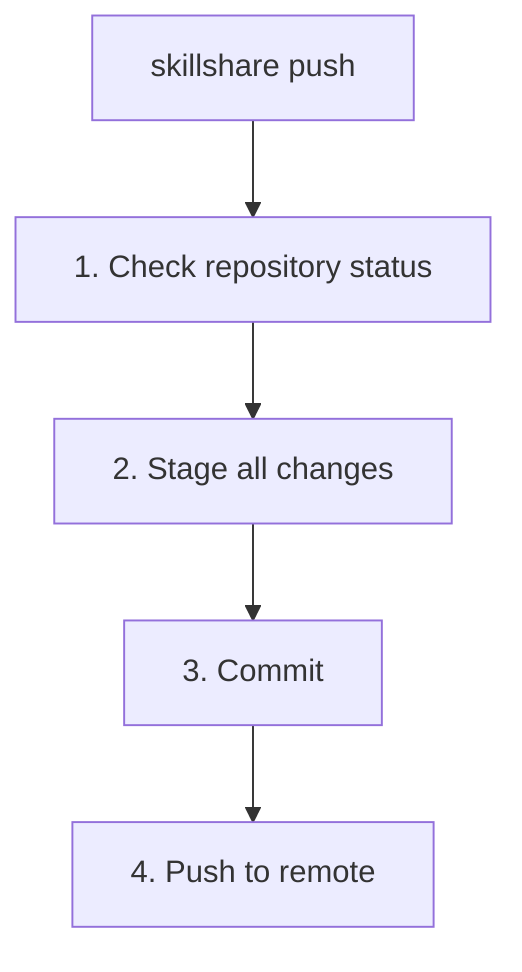

# push

Commit 並將 source 推送到 git remote。

如果你只想建立本機檢查點而不推送，請改用 [`commit`](./commit.md)。

```bash
skillshare push                  # Auto-generated message
skillshare push -m "Add pdf"     # Custom message
skillshare push --dry-run        # Preview
```

## 何時使用

- 透過 git 把 skill 變更分享到你的其他機器
- 把 skills 備份到 remote repository
- 編輯 skills 後，一次完成 commit 與 push

如果只想先建立本機檢查點而尚未要分享，請使用 [`skillshare commit`](./commit.md)。

## 執行流程



## 選項

| Flag | Description |
|------|-------------|
| `-m, --message <msg>` | Commit message (default: "Update skills") |
| `--dry-run, -n` | Preview without making changes |

## Git Root 範圍

`push` 會操作 `git_root` 設定欄位所選定的目錄（預設為 `skills` source）。範圍對照表參見 [commit — Git Root Scope](./commit.md#git-root-scope)。如果 `git_root` 已變更，但 git repo 仍存在於另一個 scope 的目錄下，`push` 會印出「Git root mismatch」錯誤，並附上確切的 `git init` / `mv` 修正指令。參見 [init 之後變更 scope](/docs/reference/targets/configuration#git-root)。

## 先決條件

你的 source 目錄必須是一個帶有 remote 的 git repository：

```bash
# Set up during init (recommended):
skillshare init --remote git@github.com:you/my-skills.git

# Or add remote to existing setup:
skillshare init --remote git@github.com:you/my-skills.git
```

Init 會自動建立初始 commit，所以設定完成後 `push` 可以立即使用。

## 首次 Push 的 Upstream 對應

在第一次 push（尚未設定 upstream tracking）時，`skillshare push` 會自動設定 upstream：

- 如果 remote 已經有預設分支（例如 `main` 或 `trunk`），本機變更會被推送到該 remote 預設分支。
- 如果 remote 是空的，則推送到你目前的本機分支。

這可以避免意外建立錯誤的 remote 分支（例如本機是 `master` 但 remote 使用 `main`）。

## 範例

```bash
# Quick push with auto message
skillshare push

# Custom commit message
skillshare push -m "Add commit-commands skill"

# Preview what would be pushed
skillshare push --dry-run
```

## 衝突處理

如果 remote 有較新的 commits：

```bash
$ skillshare push
Push failed
  Remote may have newer changes
  Run: skillshare pull
  Then: skillshare push
```

解決方法：
```bash
skillshare pull    # Merge remote changes with yours
skillshare push    # Push your changes
```

`pull` 會把 remote 的 commits 和你尚未 push 的 commits 合併，所以第二次 `push` 就會成功。如果兩邊改了同一個檔案，請參閱[兩台機器都有 Commit 時](/docs/reference/commands/pull#when-both-machines-committed)。

## 工作流程

分享 skills 的典型工作流程：

```bash
# 1. Make changes to skills
# 2. Push to remote
skillshare push -m "Update my-skill"

# On another machine:
skillshare pull    # Gets changes and syncs
```

## 另請參閱

- [commit](/docs/reference/commands/commit) — 在不推送的情況下本機 commit
- [pull](/docs/reference/commands/pull) — 從 remote 拉取
- [sync](/docs/reference/commands/sync) — 同步到本機 targets
- [Cross-Machine Sync](/docs/how-to/sharing/cross-machine-sync) — 完整設定說明
