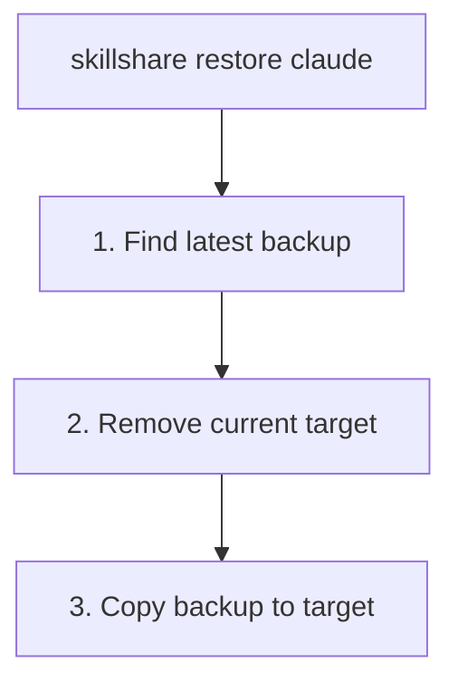

# restore

從備份還原 target。

```bash
skillshare restore                                     # Interactive TUI (browse + restore)
skillshare restore claude                              # Latest backup
skillshare restore claude --from 2026-01-19_10-00-00   # Specific backup
skillshare restore claude --dry-run                    # Preview
```

## 何時使用

- sync 出錯，需要把 target 還原到先前的狀態
- 不小心從 target 移除了 skills
- 想互動式瀏覽備份版本並與目前狀態比較

## 互動式 TUI

在 TTY 環境下，不帶參數執行 `skillshare restore` 會啟動一個統一的還原 TUI：

1. **來源選擇器** — 在「Backup Restore」與「Trash Restore」之間選擇
2. **Backup Restore** — 選擇一個 target，接著瀏覽備份版本，並在細節面板中看到：
   - 備份日期、大小與 skill 數量
   - 與目前 target 的差異（新增／移除的 skills）
   - 個別檔案列表
3. **Trash Restore** — 開啟 trash TUI 以還原已刪除的 skills

### 按鍵綁定

| Key | Action |
|-----|--------|
| `↑`/`↓` | Navigate targets / versions |
| `Enter` | Select target / restore version |
| `/` | Filter targets |
| `d` | Delete a backup version |
| `Ctrl+d`/`Ctrl+u` | Scroll detail panel |
| `Esc` | Go back |
| `q`/`Ctrl+C` | Quit |

使用 `--no-tui` 可跳過 TUI，改顯示純文字的備份清單。

## 執行流程



## 選項

| Flag | Description |
|------|-------------|
| `--all` | Restore both skills and agents |
| `--project, -p` | Use project mode (`.skillshare/backups/`); **agents only** |
| `--global, -g` | Use global mode (default for skills) |
| `--from, -f <timestamp>` | Restore from specific backup |
| `--force` | Overwrite without confirmation |
| `--dry-run, -n` | Preview without making changes |
| `--no-tui` | Skip interactive TUI, show backup list instead |

`restore` 也接受一個位置參數（positional kind argument）：`skillshare restore agents claude` 會還原 `claude` target 的 agent 備份。

## 尋找備份

列出可用的備份：

```bash
skillshare backup --list
```

```
All backups (15.3 MB total)
  2026-01-20_15-30-00  claude, cursor     4.2 MB
  2026-01-19_10-00-00  claude             2.1 MB
  2026-01-18_09-00-00  claude, cursor     4.0 MB
```

## 範例

```bash
# Restore from latest backup
skillshare restore claude

# Restore from specific backup
skillshare restore claude --from 2026-01-19_10-00-00

# Preview restore
skillshare restore claude --dry-run

# Force restore (skip confirmation)
skillshare restore claude --force
```

## 還原之後

`restore` 會用快照的內容取代整個 target 目錄。因為備份只保存本機內容——symlink 的 skills 會被排除，參見[備份內容](/docs/reference/commands/backup#what-gets-backed-up)——之後請執行 `sync` 把已同步的 skills 帶回來：

```bash
skillshare restore claude    # Restore local content from backup
skillshare sync              # Recreate symlinks for synced skills
```

還原後的內容是一般檔案，不是 symlinks。如果 target 一直以來只存放本機的 skills，單獨執行 restore 就已經足夠。

## 使用情境

### 意外刪除

如果你不小心刪除了某個 skill：

```bash
skillshare restore claude --from 2026-01-19_10-00-00
```

### 復原變更

如果 sync 出了問題：

```bash
skillshare restore claude  # Go back to pre-sync state
```

### 測試

還原以測試舊版本的 skill：

```bash
skillshare restore claude --from 2026-01-15_10-00-00
# Test old skills...
skillshare sync  # Return to current state
```

### Agent 還原

Agent 還原的方式與 skill 還原相同，但操作的是由 `backup agents`（以及 `sync agents` 前的自動備份）建立的並行 `<target>-agents` 備份條目：

```bash
skillshare restore agents claude                       # Latest agent backup for claude
skillshare restore agents claude --from 2026-01-19_10-00-00
skillshare restore agents -p                           # Project agents (the only project mode allowed)
skillshare restore --all claude                        # Skills + agents in one shot
```

在 project mode 下，restore 和 backup 一樣，只能操作 agents。若不加上 `agents` 參數會報錯：

```
restore is not supported in project mode (except for agents)
```

透過 `skillshare backup --list` 列出備份時，agent 備份會以帶有 `-agents` 後綴的獨立條目顯示（例如 `claude-agents`）。

## 另請參閱

- [backup](/docs/reference/commands/backup) — 建立與管理備份
- [sync](/docs/reference/commands/sync) — 還原後重新同步
- [Agents](/docs/understand/agents) — Agent 資源模型
