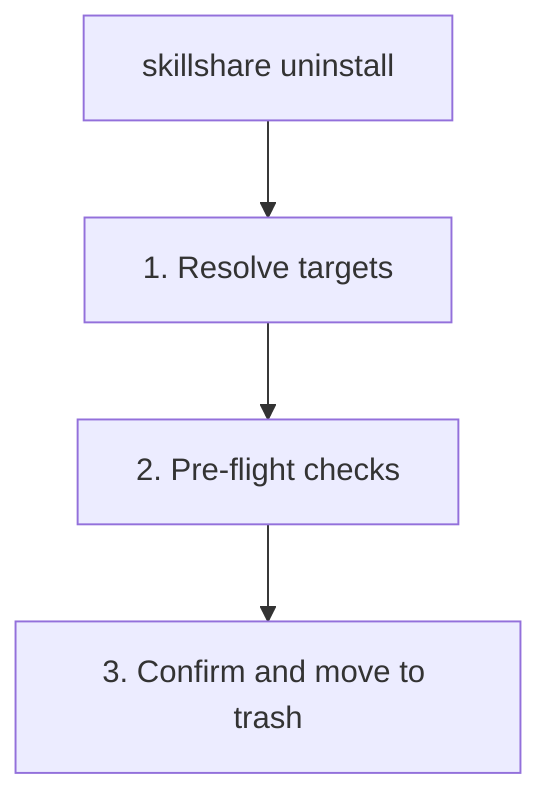

# uninstall

從 source 目錄移除一個或多個 skills 或 tracked repositories。Skills 會先移到 trash，保留 7 天後才會自動清除。

```bash
skillshare uninstall my-skill              # 移除單一 skill
skillshare uninstall a b c --force         # 一次移除多個 skills
skillshare uninstall --all                 # 移除所有 skills
skillshare uninstall --group frontend      # 移除某個群組中的所有 skills
skillshare uninstall team-repo             # 移除 tracked repository（_ 前綴為選填）
```

## 何時使用

- 移除不再需要的 skills（會移到 trash 保留 7 天）
- 清理已停止使用的 tracked repository
- 一次批次移除整個群組的 skills
- 用 `--all` 一次移除**所有** skills


## 發生了什麼



## 選項

| 旗標 | 說明 |
|------|-------------|
| `--all` | 從 source 移除**所有** skills（需要確認） |
| `--group, -G <name>` | 移除某個群組下的所有 skills（前綴比對，可重複使用） |
| `--force, -f` | 跳過確認並忽略未提交的變更 |
| `--dry-run, -n` | 預覽而不實際變更 |
| `--project, -p` | 使用目前目錄的專案層級設定 |
| `--global, -g` | 使用全域設定（`~/.config/skillshare`） |
| `--json` | Global mode：以 JSON 輸出並跳過確認；有未提交變更的 tracked repositories 仍需要 `--force` |
| `--help, -h` | 顯示說明 |

## JSON 輸出

```bash
skillshare uninstall my-skill another-skill --json
```

```json
{
  "removed": ["my-skill", "another-skill"],
  "failed": [],
  "skipped": 0,
  "dry_run": false,
  "duration": "0.089s"
}
```

搭配 `--dry-run` 可預覽：

```bash
skillshare uninstall --all --json --dry-run
```

## 多個 Skills

用一個指令移除多個 skills：

```bash
skillshare uninstall alpha beta gamma --force
```

當部分 skills 找不到時，指令會**跳過並顯示警告**，繼續移除其餘的。只有當**所有**指定的 skills 都無效時，指令才會失敗。

### Glob Patterns

Skill 名稱支援 glob patterns（`*`、`?`、`[...]`）以進行批次移除：

```bash
skillshare uninstall "core-*"              # 移除所有符合 core-* 的 skills
skillshare uninstall "test-?" --force      # 單一字元萬用字元
skillshare uninstall "core-*" "util-*"     # 多個 patterns
```

Glob 比對不分大小寫：`"Core-*"` 會比對到 `core-auth`、`CORE-DB` 等。

:::note 僅比對頂層
Glob patterns 只會比對 source 資料夾中的**頂層目錄名稱**。巢狀 skills（例如 `frontend/react-hooks`）不會被 `"react-*"` 比對到 — 請用 `--group frontend` 來鎖定子目錄中的 skills。
:::

## 移除全部

用 `--all` 一次移除 source 目錄中的每個 skill：

```bash
skillshare uninstall --all                 # 互動式確認
skillshare uninstall --all --force         # 跳過確認
skillshare uninstall --all -n              # 預覽將被移除的內容
```

`--all` 不能與 skill 名稱或 `--group` 一起使用。

:::tip Shell glob 保護
不加引號執行 `skillshare uninstall *` 會讓 shell 把 `*` 展開成目前目錄中的檔名。skillshare 會偵測到這個情況並建議改用 `--all`。請務必為萬用字元加上引號（`"*"`）或改用 `--all`。
:::

## 群組移除

當你解除安裝一個包含子 skills 的目錄時，skillshare 會自動偵測它是一個**群組**，並在要求確認前列出所包含的 skills：

```
Uninstalling group (5 skills)
─────────────────────────────────────────
  - feature-radar
  - feature-radar-archive
  - feature-radar-learn
  - feature-radar-ref
  - feature-radar-scan
→ Name: feature-radar
→ Path: ~/.config/skillshare/skills/feature-radar

Are you sure you want to uninstall this group? [y/N]:
```

`--group` 旗標會使用**前綴比對**移除某目錄下的所有 skills：

```bash
# 移除 frontend/ 下的所有 skills
skillshare uninstall --group frontend

# 也會移除巢狀 skills：frontend/react/hooks、frontend/vue/composables
skillshare uninstall --group frontend --force

# 預覽將被移除的內容
skillshare uninstall --group frontend --dry-run
```

執行群組移除時（包括自動偵測到的目錄群組），每個被移除的成員也會從設定檔（`~/.config/skillshare/config.yaml`，或 project mode 下的 `.skillshare/config.yaml`）中受管理的 `skills:` 清單移除。

你可以把定位參數的名稱與 `--group` 混用，甚至可以多次使用 `-G`：

```bash
# 混合名稱與群組
skillshare uninstall standalone-skill -G frontend -G backend --force

# 重複項目會自動去除
skillshare uninstall frontend/hooks -G frontend --force  # hooks 只會被移除一次
```

## Tracked Repositories

對於 tracked repositories（以 `_` 開頭的資料夾）：

- 會檢查未提交的變更（用 `--force` 可覆蓋）
- 自動從 `.gitignore` 移除該項目
- 解除安裝時 `_` 前綴為選填

```bash
skillshare uninstall _team-skills        # 含前綴
skillshare uninstall team-skills         # 不含前綴（自動偵測）
skillshare uninstall _team-skills --force # 強制移除，即使有未提交的變更
```

## 範例

```bash
# 移除單一 skill
skillshare uninstall my-skill

# 移除多個 skills
skillshare uninstall skill-a skill-b skill-c --force

# 移除所有 skills
skillshare uninstall --all
skillshare uninstall --all --force
skillshare uninstall --all -n              # 預覽

# 依群組移除
skillshare uninstall --group frontend --force

# 預覽移除
skillshare uninstall my-skill --dry-run
skillshare uninstall --group frontend -n

# 移除 tracked repository
skillshare uninstall team-repo

# 混合名稱與群組
skillshare uninstall my-skill -G frontend --force
```

## 安全性

解除安裝的 skills 會被**移到 trash**，而非永久刪除：

- **位置：** `~/.local/share/skillshare/trash/`（global）或 `.skillshare/trash/`（project）
- **保留期：** 7 天，之後自動清除
- **重新安裝提示：** 如果該 skill 是從遠端來源安裝的，會顯示重新安裝的指令
- **還原：** 用 `skillshare trash restore <name>` 從 trash 中復原

單一 skill（詳細）：

```
✓ Uninstalled skill: my-skill
ℹ Moved to trash (7 days): ~/.local/share/skillshare/trash/my-skill_2026-01-20_15-30-00
ℹ Reinstall: skillshare install github.com/user/repo/my-skill
```

多個 skills（批次）：

```
✓ Uninstalled 4 skill(s) (0.1s)

── Removed ─────────────────────────────
✓ pdf        skill
✓ tdd        skill
✓ security   group, 2 skills
✗ bad-skill  failed to move to trash: ...

── Next Steps ──────────────────────────
ℹ Moved to trash (7 days).
ℹ Run 'skillshare sync' to update all targets
```

大批次會使用精簡格式：

```
✓ Uninstalled 920, failed 2 (1.2s)

── Failed ──────────────────────────────
✗ bad-a  failed to move to trash: permission denied
✗ bad-b  failed to move to trash: permission denied

── Removed ─────────────────────────────
✓ 920 uninstalled

── Next Steps ──────────────────────────
ℹ Moved to trash (7 days).
ℹ Run 'skillshare sync' to update all targets
```

若要還原不小心解除安裝的 skill：

```bash
skillshare trash list                  # 查看 trash 中的內容
skillshare trash restore my-skill      # 還原到 source
skillshare sync                        # 同步回 targets
```

## 解除安裝之後

執行 `skillshare sync` 以從所有 targets 移除該 skill：

```bash
skillshare uninstall old-skill
skillshare sync  # 從 Claude、Cursor 等移除
```

## Project Mode

從專案的 `.skillshare/skills/` 解除安裝 skills 或 tracked repos：

```bash
skillshare uninstall my-skill -p                  # 移除一個 skill
skillshare uninstall a b c -p -f                  # 移除多個 skills
skillshare uninstall --all -p -f                   # 移除所有專案 skills
skillshare uninstall --group frontend -p -f        # 移除一個群組
skillshare uninstall team-skills -p                # Tracked repo（_ 前綴為選填）
```

在 project mode 中，uninstall 會：
- 把 skill 目錄移到 `.skillshare/trash/`（保留 7 天）
- 從 `.skillshare/config.yaml` 的 `skills:` 清單移除該 skill 項目（適用於 remote skills）
- 從 `.skillshare/.gitignore` 移除該項目（適用於 remote/tracked skills）
- 從 `.skillshare/skills.lock.json` 移除該 skill 的釘選（若是群組，則移除其下的每個釘選）
- 對於 tracked repos：檢查未提交的變更（用 `--force` 可覆蓋）
- `_` 前綴為選填 — 會自動偵測

```bash
skillshare uninstall pdf -p
skillshare sync
git add .skillshare/ && git commit -m "Remove pdf skill"
```

## Agent 支援

使用 `--kind agent` 來解除安裝 agents 而非 skills：

```bash
skillshare uninstall --kind agent tutor              # 移除一個 agent
skillshare uninstall --kind agent tutor reviewer -f   # 移除多個 agents
skillshare uninstall --kind agent --all               # 移除所有 agents
```

Agent 解除安裝遵循與 skills 相同的 trash 保留行為（移到 trash，保留 7 天）。背景說明見 [Agents](/docs/understand/agents)。

## 另見

- [install](/docs/reference/commands/install) — 安裝 skills
- [list](/docs/reference/commands/list) — 列出已安裝的 skills
- [trash](/docs/reference/commands/trash) — 管理 trash 中的 skills
- [Project Skills](/docs/understand/project-skills) — Project mode 概念
- [Agents](/docs/understand/agents) — Agent 概念
