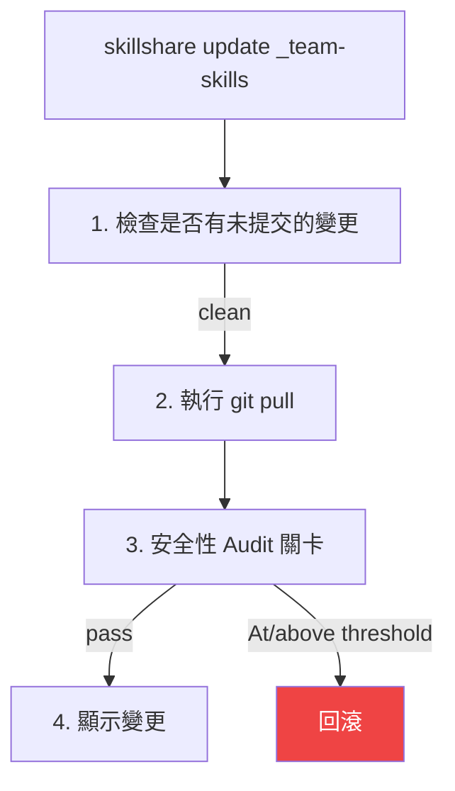
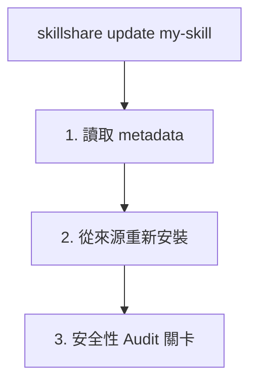

# update

將一個或多個 skills 或 tracked 儲存庫更新到最新版本。

```bash
skillshare update my-skill           # 更新單一 skill
skillshare update a b c              # 一次更新多個
skillshare update --group frontend   # 更新群組中所有 skills
skillshare update team-skills        # 更新 tracked 儲存庫
skillshare update --all              # 更新全部
skillshare update agents --all       # 更新所有 tracked/可更新的 agents
```

## 使用時機

- 某個 tracked 儲存庫有新的 commits（透過 `check` 發現）
- 某個已安裝的 skill 有新版本可用
- 你想從原始來源重新下載某個 skill


## 執行內容

### 對於 Tracked 儲存庫



### 對於一般 Skills



## 選項

| Flag | 說明 |
|------|-------------|
| `--all, -a` | 更新所有 tracked 儲存庫/skills，或在 `update agents --all` 中更新所有 agents |
| `--group, -G <name>` | 更新群組中所有可更新的 skills，或某個 agent 子目錄中所有 agents |
| `--force, -f` | 捨棄本機變更並強制執行，即使有 audit 發現的問題 |
| `--dry-run, -n` | 預覽而不做任何變更 |
| `--skip-audit` | 跳過更新後的安全性 audit 關卡 |
| `--audit-threshold <t>`, `--threshold <t>`, `-T <t>` | 覆寫更新 audit 的封鎖門檻（`critical|high|medium|low|info`；簡寫：`c|h|m|l|i`，以及 `crit`、`med`） |
| `--diff` | 在 skill/儲存庫更新後顯示檔案層級的變更摘要 |
| `--audit-verbose` | 在批次模式下顯示每個 skill 的詳細 audit 發現 |
| `--prune` | 移除過期的 skills（上游已刪除），而非僅發出警告 |
| `--project, -p` | 使用目前目錄的 project 層級設定 |
| `--global, -g` | 使用 global 設定（`~/.config/skillshare`） |
| `--json` | 以 JSON 輸出 |
| `--help, -h` | 顯示說明 |

`update agents` 支援：`--all`、`--group`、`--force`、`--dry-run`、`--skip-audit`、`--audit-threshold` / `--threshold` / `-T`、`--json`，以及 `--project` / `--global`。它**不**支援 `--diff`、`--audit-verbose` 或 `--prune`。

## JSON 輸出

```bash
skillshare update --all --json
```

```json
{
  "updated": 3,
  "skipped": 1,
  "security_failed": 0,
  "pruned": 0,
  "dry_run": false,
  "duration": "4.567s",
  "items": [
    {"name": "_team-skills", "type": "repo", "status": "updated"},
    {"name": "my-skill", "type": "skill", "status": "updated"},
    {"name": "another-skill", "type": "skill", "status": "updated"},
    {"name": "local-only", "type": "skill", "status": "skipped"}
  ]
}
```

可能的 `status` 值：`updated`、`skipped`、`failed`、`security_blocked`。當某個項目失敗時，會包含 `error` 欄位。

當 tracked 儲存庫已在 metadata 中宣告但實際磁碟上缺失時，每個項目會被回報為已跳過的 `repo` 項目，附上簡短的 `error`（`clone directory absent`），並在彙總的 `missing_tracked_repos` 中列出名稱及一次性的復原提示：

```json
{
  "updated": 0,
  "skipped": 1,
  "items": [
    {"name": "_team-skills", "type": "repo", "status": "skipped", "error": "clone directory absent"}
  ],
  "missing_tracked_repos": {
    "names": ["_team-skills"],
    "hint": "Run 'skillshare install' to rehydrate tracked repositories"
  }
}
```

若沒有任何 tracked 儲存庫缺失，則不會出現 `missing_tracked_repos` 欄位。

### Agent JSON 輸出

```bash
skillshare update agents --all --json
```

```json
{
  "agents": [
    {"name": "reviewer", "status": "updated", "source": "github.com/user/agents/reviewer.md"},
    {"name": "team/tutor", "status": "up_to_date", "source": "github.com/user/agents/team/tutor.md"}
  ],
  "dry_run": false,
  "duration": "1.234s"
}
```

可能的 agent `status` 值包括 `updated`、`failed`、`skipped`、`up_to_date`、`update_available`、`dirty`、`drifted` 與 `local`。

## 更新 Agents

當你只想更新獨立的 `.md` agents 時，使用 `agents` 類型選擇器：

```bash
skillshare update agents reviewer
skillshare update agents --group team
skillshare update agents --all -T high
skillshare update agents --all --json
```

Agent 更新遵循與 skills 相同的 audit 關卡：

- tracked agent 儲存庫執行 `git pull`，然後對更新後的儲存庫做 audit
- 由 metadata 支援的單檔 agents 會從來源重新安裝，對暫存的 `.md` 做 audit，只有成功時才會取代本機檔案

## 更新多個

一次更新多個 skills：

```bash
skillshare update skill-a skill-b skill-c
```

只有可更新的 skills（tracked 儲存庫或有 metadata 的 skills）會被處理。找不到的 skills 會有警告但不會導致失敗。不過，若任何 skill 被**安全性 audit 關卡封鎖**，批次指令會以非零狀態碼結束。

### Glob 模式

Skill 名稱支援 glob 模式（`*`、`?`、`[...]`）用於批次操作：

```bash
skillshare update "core-*"              # 更新所有符合 core-* 的 skills
skillshare update "_team-?"             # 單字元萬用字元
skillshare update "core-*" "util-*"     # 多個模式
```

Glob 模式比對的是每個 skill 或 tracked 儲存庫的**基底名稱**（路徑最後一段）。例如，`"react-*"` 會比對到 `frontend/react-hooks`，因為其基底名稱是 `react-hooks`。

Glob 比對不分大小寫：`"Core-*"` 會比對到 `core-auth`、`CORE-DB` 等。

:::tip Shell Glob 保護
務必以引號包住 glob 模式（`"core-*"`），以避免你的 shell 將 `*` 展開成目前目錄中的檔案名稱。
:::

## 更新群組

更新群組目錄中所有可更新的 skills：

```bash
skillshare update --group frontend        # 更新 frontend/ 中所有 skills
skillshare update -G frontend -G backend  # 多個群組
skillshare update x -G backend            # 混用名稱與群組
```

群組中沒有 metadata 或 `.git` 的本機 skills 會被靜默跳過。

若位置參數對應到一個群組目錄（而非儲存庫或 skill），會自動展開：

```bash
skillshare update frontend   # 等同於 --group frontend
# ℹ 'frontend' is a group — expanding to 3 updatable skill(s)
```

:::note
`--all` 不能與 skill 名稱或 `--group` 合併使用。
:::

## 更新全部

一次更新所有內容：

```bash
skillshare update --all
```

這會更新：
1. 所有 tracked 儲存庫（git pull）
2. 所有帶有來源 metadata 的 skills（重新安裝）

### 輸出範例

```
Updating 2 tracked repos + 3 skills

[1/5] ✓ _team-skills       Already up to date
[2/5] ✓ _personal-repo     3 commits, 2 files
[3/5] ✓ my-skill           Reinstalled from source
→ risk: LOW (12/100)
[4/5] ! other-skill        has uncommitted changes (use --force)
[5/5] ✓ another-skill      Reinstalled from source

── Summary ─────────────────────────────
  Total:    5
  Updated:  4
  Skipped:  1
```

### 缺失的 Tracked 儲存庫

若 `.metadata.json` 宣告了某個 tracked 儲存庫（`tracked: true`），但其 clone 目錄在磁碟上不存在 — 這在全新的機器上很常見，因為 clone 目錄位於受管理的 `.gitignore` 區塊中 — `update --all` 不會再靜默跳過它。它會回報每個缺失的儲存庫，並提示你進行復原：

```
! 1 tracked repo(s) declared in metadata but missing on disk:
  ! _team-skills         clone directory absent
→ Run 'skillshare install' to rehydrate tracked repositories
```

這適用於 global 與 project（`-p`）模式。若要從 metadata 重新建立 clones，執行不帶參數的 [install](/docs/reference/commands/install)（詳見 [Rehydrating After a Fresh Clone](/docs/understand/tracked-repositories#rehydrating-after-a-fresh-clone)）。

## 清理過期 Skills（`--prune`）

當上游儲存庫重新命名或移除某個 skill 時，`update` 會偵測為 **stale（過期）** 並發出警告：

```
⚠ 1 skill(s) no longer found in upstream repository:
  ⚠ frontend/old-skill — stale (deleted upstream)
ℹ Run with --prune to remove stale skills
```

加上 `--prune` 可自動移除過期的 skills（移到垃圾桶，而非永久刪除）：

```bash
skillshare update --all --prune
```

`check` 也會回報過期的 skills：

```bash
skillshare check --all
# ⚠ 1 skill(s) stale (deleted upstream) — run 'skillshare update --all --prune' to remove
```

:::note
Tracked 儲存庫（`_repo`）不受 `--prune` 影響。當 tracked 儲存庫內部移除某個 skill 時，`sync` 會透過 `PruneOrphanLinks` 自動清理孤立的 symlinks。
:::

## 安全性 Audit 關卡 {#security-audit-gate}

在更新 skills 後，`update` 會自動執行安全性 audit：

- **Tracked 儲存庫（`git pull`）** 使用 pull 後的關卡，門檻為目前生效的門檻（`audit.block_threshold`，預設為 `CRITICAL`）
- **一般 skills（重新安裝路徑）** 使用相同的門檻政策
- 對於所有更新類型，都會顯示風險標籤/分數以供檢視參考

```
→ risk: LOW (12/100)
```

### 互動模式（TTY，Tracked 儲存庫）

當偵測到達到或超過目前生效門檻的發現時，你會被提示做出決定：

```
  [HIGH] Source repository link detected — may be used for supply-chain redirects (SKILL.md:5)

  Security findings at or above active threshold detected.
  Apply anyway? [y/N]:
```

- **`y`** — 接受更新，即使有發現的問題
- **`N`**（預設）— 回滾到 pull 前的狀態

### 非互動模式（CI/CD）

在非互動環境中，更新會自動回滾，且指令會以非零狀態碼結束。這確保了 CI pipeline 中的 fail-closed 行為。

```bash
# 當你信任來源時，可繞過 audit 關卡
skillshare update --all --skip-audit
```

:::caution
`--skip-audit` 會完全停用更新後的安全性掃描。僅在你信任來源，或有外部 audit 流程時才使用。
:::

### 已接受的發現 {#accepted-findings}

當你以 `--force`（或在提示中回答 `y`）覆寫關卡時，你所接受的發現會記錄在 `.metadata.json` 的 `audit_accepted` 下。同一個 skill 之後的更新不會再對這些完全相同的發現封鎖，因此你不需要在每次 `update --all` 都重複 `--force`。

```
ℹ 1 previously accepted finding(s) skipped
```

一項發現是以規則、檔案與比對到的文字來比對 — 而非行號 — 因此即使無關內容有位移，它仍會維持已接受狀態。任何新的發現，或同一規則比對到不同文字，都會再次封鎖。這適合會合理引用攻擊字串作為範例的 skills（例如安全掃描工具、紅隊文件），同時仍能在後續版本中攔截新的 payload。

你可以用 `--audit-threshold`、`--threshold` 或 `-T` 針對單一指令覆寫門檻：

```bash
skillshare update _team-skills --threshold high
skillshare update --all -T h
```

## 檔案變更摘要（`--diff`）

使用 `--diff` 在每次更新後查看檔案層級的變更摘要：

```bash
skillshare update team-skills --diff
skillshare update --all --diff
```

對於 **tracked 儲存庫**，diff 使用 `git diff`，並包含行層級的統計數字：

```
┌─ Files Changed ─────────────────────────────┐
│                                             │
│  ~ SKILL.md (+12 -3)                        │
│  + scripts/deploy.sh (+45 -0)               │
│  - old-helper.sh (+0 -22)                   │
│  ~ utils/format.md (+5 -2)                  │
│                                             │
└─────────────────────────────────────────────┘
```

對於**一般 skills**（從遠端來源安裝），diff 會比較重新安裝前後的檔案雜湊值：

```
┌─ Files Changed ─────────────────────────────┐
│                                             │
│  ~ SKILL.md                                 │
│  + new-helper.sh                            │
│                                             │
└─────────────────────────────────────────────┘
```

標記：`+` 新增、`-` 刪除、`~` 修改。最多顯示 20 個檔案；超過的檔案會彙總為「... and N more file(s)」。

## 處理衝突

若 tracked 儲存庫有未提交的變更：

```bash
# 選項 1：先提交你的變更
cd ~/.config/skillshare/skills/_team-skills
git add . && git commit -m "My changes"
skillshare update _team-skills

# 選項 2：捨棄並強制更新
skillshare update _team-skills --force
```

## 更新後

執行 `skillshare sync` 將變更分發到所有 targets：

```bash
skillshare update --all --diff   # 帶檔案層級變更摘要的更新
skillshare sync
```

## Project 模式

更新 project 中的 skills 與 tracked 儲存庫：

```bash
skillshare update pdf -p              # 更新單一 skill（重新安裝）
skillshare update a b c -p            # 更新多個 skills
skillshare update --group frontend -p # 更新群組中所有 skills
skillshare update team-skills -p      # 更新 tracked 儲存庫（git pull）
skillshare update --all -p            # 更新全部
skillshare update --all -p --dry-run  # 預覽
skillshare update --all -p --diff     # 帶檔案變更摘要的更新
skillshare update --all -p --skip-audit  # 跳過安全性 audit 關卡
```

### 運作方式

| 類型 | 方法 | 判斷依據 |
|------|--------|-------------|
| **Tracked 儲存庫**（`_repo`） | `git pull` | 有 `.git/` 目錄 |
| **遠端 skill**（有 metadata） | 從來源重新安裝 | 列於 `.metadata.json` |
| **本機 skill** | 跳過 | 未列於 `.metadata.json` |

`_` 前綴是選填的 — `skillshare update team-skills -p` 會自動偵測為 `_team-skills`。

### 處理衝突

有未提交變更的 tracked 儲存庫預設會被封鎖：

```bash
# 選項 1：先提交變更
cd .skillshare/skills/_team-skills
git add . && git commit -m "My changes"
skillshare update team-skills -p

# 選項 2：捨棄並強制更新
skillshare update team-skills -p --force
```

### 典型工作流程

```bash
skillshare update --all -p
skillshare sync
git add .skillshare/ && git commit -m "Update remote skills"
```

## 另請參閱

- [install](/docs/reference/commands/install) — 安裝 skills
- [upgrade](/docs/reference/commands/upgrade) — 升級 CLI 與內建 skill
- [sync](/docs/reference/commands/sync) — 同步到 targets
- [Project Skills](/docs/understand/project-skills) — Project 模式概念
