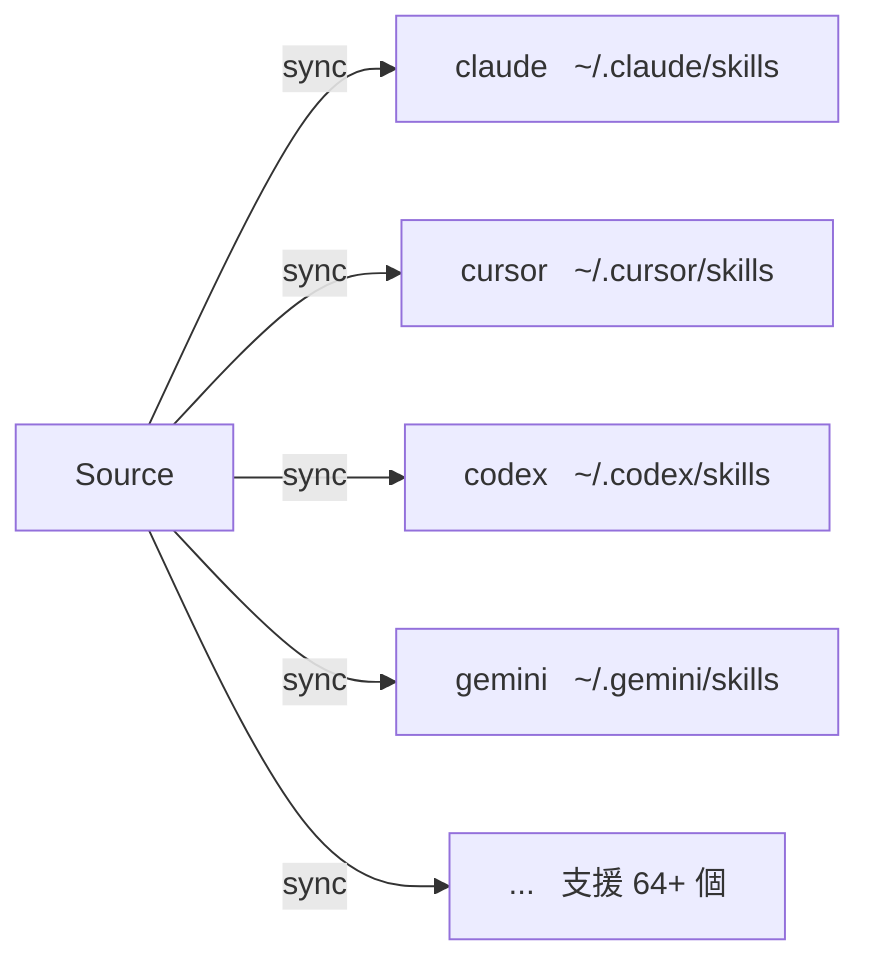

# Targets

Targets 是 skillshare 同步的 AI CLI Skill 目錄。

## 總覽



## 你想做什麼？

| 我想要... | 閱讀 |
|--------------|------|
| 查看支援哪些 AI CLI | [支援的 Targets](./supported-targets.md) |
| 新增內建清單中沒有的 Target | [新增自訂 Targets](./adding-custom-targets.md) |
| 設定 Sync 模式、篩選條件或路徑 | [設定](./configuration.md) |

## 快速連結

| 主題 | 說明 |
|-------|-------------|
| [支援的 Targets](./supported-targets.md) | 64+ 個支援的 AI CLI 完整清單 |
| [新增自訂 Targets](./adding-custom-targets.md) | 新增任何有 Skill 目錄的工具 |
| [設定](./configuration.md) | 設定檔參考 |

---

## 常見操作

### 列出 Targets

```bash
skillshare target list
```

### 顯示 Target 詳細資訊

```bash
skillshare target claude
```

### 變更 Sync 模式

```bash
skillshare target claude --mode symlink
skillshare sync
```

### 新增自訂 Target

```bash
skillshare target add myapp ~/.myapp/skills
skillshare sync
```

### 移除 Target

```bash
skillshare target remove claude
```

---

## 自動偵測

執行 `skillshare init` 時，已安裝的 AI CLI 會被自動偵測並新增為 Target。

只有存在的路徑會被新增。完整的檢查路徑清單請參閱[支援的 Targets](./supported-targets.md)。

---

## 相關文件

- [Source 與 Targets](/docs/understand/source-and-targets) — 核心概念
- [Sync 模式](/docs/understand/sync-modes) — Merge、copy、symlink
- [指令：target](/docs/reference/commands/target) — Target 指令細節
