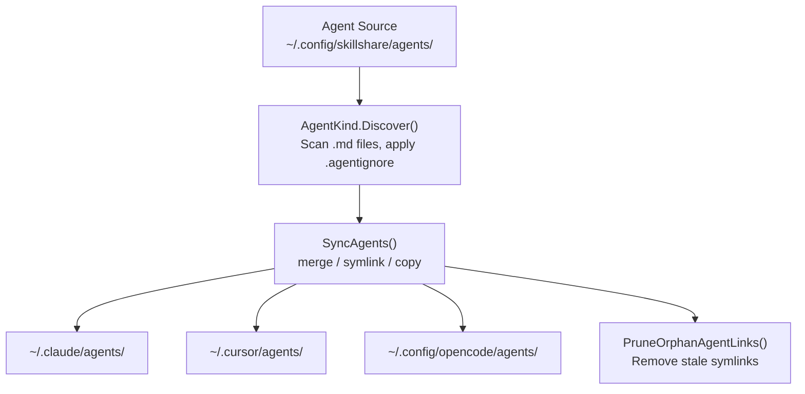

# Agents

與 skills 並行管理的單一檔案 `.md` 資源 — 相同的 sync、audit 與生命週期，但形式不同。

:::tip 這什麼時候重要？
部分 AI CLI（Claude Code、Cursor、OpenCode、Augment、Copilot CLI、Droid）會區分**skills**（含 `SKILL.md` 的目錄）與**agents**（獨立的 `.md` 檔案）。如果你的 targets 支援 agents，skillshare 就能從單一 source of truth 同時管理兩者。
:::

## Skills vs Agents

| | Skill | Agent |
|---|---|---|
| **形式** | 包含 `SKILL.md` 及選用檔案的目錄 | 單一 `.md` 檔案 |
| **名稱解析** | `SKILL.md` frontmatter 的 `name` 欄位 | 檔名（例如 `tutor.md` = "tutor"），可用 frontmatter 的 `name` 覆寫 |
| **Source 目錄** | `~/.config/skillshare/skills/` | `~/.config/skillshare/agents/`（可透過 `agents_source` 自訂） |
| **Project source** | `.skillshare/skills/` | `.skillshare/agents/` |
| **Ignore 檔案** | `.skillignore` | `.agentignore` |
| **Sync 單位** | 目錄 symlink（merge）、整個目錄 symlink（symlink）、目錄複製（copy） | 檔案 symlink（merge）、整個目錄 symlink（symlink）、檔案複製（copy） |
| **巢狀支援** | `path/to/skill` 攤平為 `path__to__skill` | `dir/file.md` 攤平為 `dir__file.md` |
| **追蹤** | 支援 | 支援 |
| **稽核** | 支援 | 支援 |
| **收集** | 支援 | 支援 |

---

## 目錄結構

### Global

```
~/.config/skillshare/
├── skills/              # Skill source (directories)
│   ├── my-skill/
│   │   └── SKILL.md
│   └── .skillignore
├── agents/              # Agent source (files)
│   ├── tutor.md
│   ├── reviewer.md
│   └── .agentignore
└── config.yaml
```

### Project

```
.skillshare/
├── skills/
│   └── api-conventions/
│       └── SKILL.md
├── agents/
│   ├── onboarding.md
│   └── .agentignore
└── config.yaml
```

### 自訂 Source 目錄

在 global mode 中，agent source 預設為 `~/.config/skillshare/agents/`。若要使用自訂位置，在 `config.yaml` 中設定 `agents_source`：

```yaml
agents_source: ~/my-agents
```

Project mode 一律使用 `.skillshare/agents/`，不支援 `agents_source`。

詳見 [Configuration — agents_source](/docs/reference/targets/configuration#agents-source)。

---

## Agent 檔案格式 {#agent-file-format}

一個 agent 就是一個純 `.md` 檔案。Frontmatter 是選用的：

```markdown
---
name: math-tutor
description: Helps with math problems step by step
targets: [claude, cursor]   # optional — only sync to these targets
---

# Math Tutor

You are a patient math tutor. Walk through problems step by step.
```

**每個 agent 各自的 targets：** 選用的 `targets` 清單可將某個 agent 限制在列出的 targets 中（例如 `claude-code` 這類別名也會比對到 `claude`）。省略此欄位則會同步到所有地方。其他 frontmatter 欄位會原樣傳遞 — skillshare 不會在工具之間轉譯這些欄位，除非該 target 使用了 [extension](#extensions)，因此為某個 harness 撰寫的 agent，另一個工具未必能理解。可利用 `targets` 讓同一個 agent 針對不同 harness 各自保留一份變體並存（例如 `reviewer.md` 搭配 `targets: [claude]`，以及 `reviewer-opencode.md` 搭配 `targets: [opencode]`）。

**命名規則：**
- 檔名決定 agent 名稱：`tutor.md` = "tutor"
- YAML frontmatter 中選用的 `name` 欄位會覆寫檔名
- 檔名必須以字母或數字開頭，只能包含 `a-z`、`A-Z`、`0-9`、`_`、`-`、`.`
- 名稱長度上限：128 字元

**慣例排除項目** — 這些檔名在探索時一律會被略過：
`README.md`、`CHANGELOG.md`、`LICENSE.md`、`HISTORY.md`、`SECURITY.md`、`SKILL.md`

---

## 支援的 Targets {#supported-targets}

只有定義了 `agents` 路徑的 targets 才會收到 agent sync。目前支援：

| Target | Global agents 路徑 | Project agents 路徑 |
|--------|-------------------|---------------------|
| `claude` | `~/.claude/agents` | `.claude/agents` |
| `cursor` | `~/.cursor/agents` | `.cursor/agents` |
| `opencode` | `~/.config/opencode/agents` | `.opencode/agents` |
| `augment` | `~/.augment/agents` | `.augment/agents` |
| `copilot` | `~/.copilot/agents` | `.github/agents` |
| `droid` | `~/.factory/droids` | `.factory/droids` |

沒有 `agents` 項目的 targets（佔多數）只會收到 skills。

---

## Sync 行為

Agent sync 支援全部三種模式，與 skills 相同：

| 模式 | 行為 |
|------|------|
| **merge**（預設） | 逐檔 symlink。Target 中的本機 agent 檔案會被保留。 |
| **symlink** | 整個 agents 目錄整包 symlink。 |
| **copy** | Agent 檔案以真實檔案複製。 |

```bash
# Sync everything (skills + agents)
skillshare sync

# Sync agents only
skillshare sync agents
```

孤兒清理的運作方式相同 — 找不到對應 source 的失效 symlink 或已複製檔案，會被自動清除。

### 使用 extension 轉換 agents {#extensions}

工具之間對 agent frontmatter 的認知並不一致，有些甚至完全不讀取 Markdown。在 target 的 `agents` 區塊設定 `extension`，就能在同步時讓每個 agent 都跑過一個 transform 腳本：

```yaml
targets:
  opencode:
    agents:
      extension: opencode-agents   # implies mode: copy
  codex:
    skills:
      path: ~/.codex/skills
    agents:
      path: ~/.codex/agents
      extension: codex-agents      # tutor.md → tutor.toml
```

- `extension` 隱含 `copy` 模式。在帶有 `extension` 的 target 上同時設定 `mode: merge` 或 `mode: symlink` 會是錯誤。
- Extension 與 extras 使用的是同一套：單純的名稱會在 `~/.config/skillshare/extensions/` 底下解析（project mode 為 `.skillshare/extensions/`），路徑則直接使用。腳本規格請參閱 [Extension transforms](/docs/reference/commands/extras#extension-transforms)。
- 當 extension 變更了副檔名，孤兒清理會跟著新名稱走，因此一旦 target 拿到 `tutor.toml`，殘留的 `tutor.md` 複本就會被移除。
- 失敗的 agent 會被回報且不會寫入；其他 agents 仍會照常同步。

網頁儀表板可從該 target 的 **Agents** 分頁設定此項。

**`opencode-agents`** 會把 Claude 風格的 agents 轉成 [OpenCode](https://opencode.ai/docs/agents/) 格式。它只保留 OpenCode 文件列出的欄位（`description`、`mode`、`model`、`temperature`、`top_p`、`steps`、`permission`、`hidden`、`color`、`prompt`），缺少 `mode` 時補上 `mode: subagent`。不是 `provider/model-id` 格式的 `model` 會被丟掉，缺少 `description` 則會失敗。設定了 Claude `tools:`、`disallowedTools:` 或 `permissionMode:` 的 agent 會直接失敗而不是用猜的：請另寫一份使用 `permission:` 並加上 `targets: [opencode]` 的 OpenCode 版本。

---

## Collect 行為

Agent collect 使用與 skill collect 相同的 CLI 介面，但作用於 `.md` agent 檔案：

```bash
# Global
skillshare collect agents claude
skillshare collect agents --all
skillshare collect agents claude --dry-run
skillshare collect agents claude --json

# Project
skillshare collect -p agents claude
skillshare collect -p agents --all
skillshare collect -p agents --json
```

規則：

- 預設會略過已存在的 source agents
- 使用 `--force` 覆寫已存在的 source agents
- `--json` 隱含 `--force`，並跳過確認提示
- 具有 agent [extension](#extensions) 的 targets 存放的是轉換後的檔案，因此永遠不會被 collect：`--all` 會略過它們，而指名其中一個則會是錯誤

---

## `.agentignore`

運作方式與 `.skillignore` 完全相同 — 以 gitignore 風格的模式，將 agents 排除在 sync 之外。

| 範圍 | 路徑 |
|-------|------|
| Global | `~/.config/skillshare/agents/.agentignore` |
| Project | `.skillshare/agents/.agentignore` |

範例：

```gitignore
# Disable draft agents
draft-*
# Disable a specific agent
experimental-reviewer
```

使用 `enable`/`disable` 搭配 `--kind agent` 來管理項目：

```bash
skillshare disable --kind agent draft-reviewer
skillshare enable --kind agent draft-reviewer
```

---

## 從 Repo 安裝 Agents

安裝一個 repository 時，skillshare 會自動偵測 agents：

1. 尋找 repo 中的 `agents/` 慣例目錄 — 其中的 `.md` 檔案（排除慣例排除項目）會被視為 agent 候選項目
2. 若 repo 同時有 `skills/` 和 `agents/`，兩者都會被安裝
3. 若 repo 只有 `agents/`（沒有 `SKILL.md` 標記），會安裝 agents
4. 若 repo 沒有 `skills/`、沒有 `agents/` 目錄，但根目錄有零散的 `.md` 檔案 — 會被視為 agents（純 agent repo）

### 明確的旗標

```bash
# Install only agents from a repo
skillshare install github.com/user/repo --kind agent

# Install specific agents by name (-a shorthand)
skillshare install github.com/user/repo -a tutor,reviewer

# Install specific skills by name (unchanged)
skillshare install github.com/user/repo -s my-skill
```

---

## CLI 指令

大多數指令都接受 `agents` 位置參數或 `--kind agent` 旗標，將範圍限定在 agents：

| 指令 | 範例 | 作用 |
|---------|---------|--------------|
| `list agents` | `skillshare list agents` | 列出 source 中的 agents |
| `check agents` | `skillshare check agents` | 檢查 agent 完整性與更新狀態 |
| `audit agents` | `skillshare audit agents` | 對 agents 進行安全掃描 |
| `sync agents` | `skillshare sync agents` | 只同步 agents 到 targets |
| `collect agents` | `skillshare collect agents claude` | 把本機 target agents 收集回 source |
| `update agents` | `skillshare update agents --all` | 更新 tracked agent repos 與 metadata-backed agents |
| `enable --kind agent` | `skillshare enable --kind agent tutor` | 重新啟用已停用的 agent |
| `disable --kind agent` | `skillshare disable --kind agent tutor` | 透過 `.agentignore` 停用一個 agent |
| `install --kind agent` | `skillshare install repo --kind agent` | 只從 repo 安裝 agents |
| `install -a` | `skillshare install repo -a tutor` | 依名稱安裝特定的 agent |

若不加 kind 篩選，指令會同時作用於 skills 與 agents。

---

## 資料流



---

## Project Mode

Agents 在 project mode 中的運作方式與 skills 相同：

```bash
# Initialize project (creates .skillshare/agents/ alongside .skillshare/skills/)
skillshare init -p

# Install agents into project
skillshare install github.com/user/repo --kind agent -p

# Update project agents in place
skillshare update agents --all -p

# Sync project agents
skillshare sync -p
```

Project agent source：`.skillshare/agents/`
已安裝的 agents（tracked）會記錄在 `.metadata.json` 中，並建立 `.gitignore` 項目，與 tracked skills 相同。
