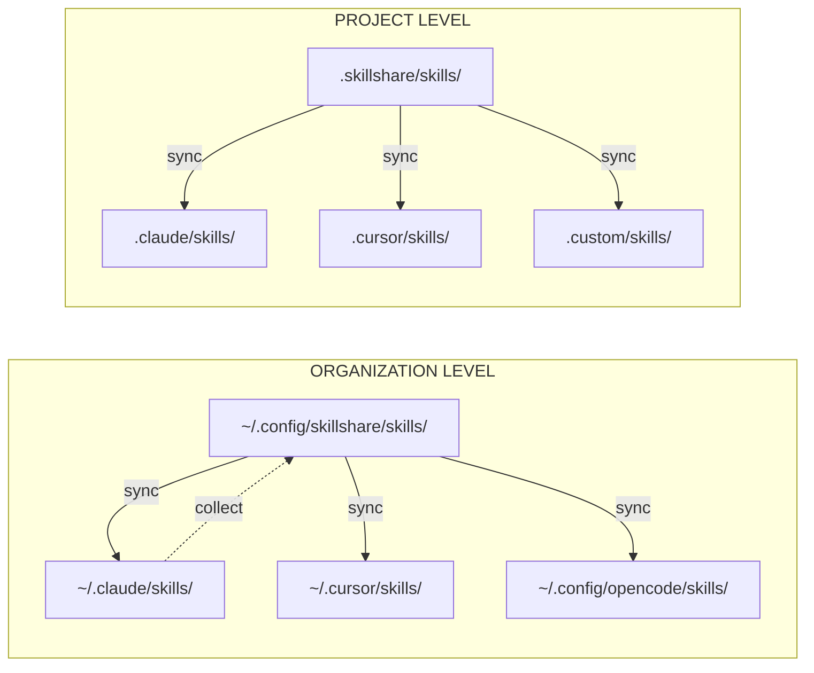

# 核心概念

理解這些概念能幫助你充分運用 skillshare。

## 你想了解什麼？

| 問題 | 閱讀 |
|----------|------|
| skillshare 如何搬動 skills？ | [Source & Targets](./source-and-targets.md) |
| merge 跟 symlink 有什麼差別？ | [Sync Modes](./sync-modes.md) |
| 如何分享組織層級的 skills？ | [Tracked Repositories](./tracked-repositories.md) |
| SKILL.md 裡面要放什麼？ | [Skill Format](./skill-format.md) |
| Project 層級的 skills 怎麼運作？ | [Project Skills](./project-skills.md) |

## 總覽

## 關鍵概念

| 概念 | 是什麼 | 深入了解 |
|---------|-----------|------------|
| **Source & Targets** | 單一事實來源，多個目的地 | [→ Source & Targets](./source-and-targets.md) |
| **Sync Modes** | Merge、copy、symlink — 檔案如何被連結 | [→ Sync Modes](./sync-modes.md) |
| **Tracked Repos** | 用 `--track` 安裝的 Git repos | [→ Tracked Repositories](./tracked-repositories.md) |
| **Skill Format** | SKILL.md 結構與 metadata | [→ Skill Format](./skill-format.md) |
| **Project Skills** | 限定於單一 repository 的 skills | [→ Project Skills](./project-skills.md) |
| **Organization Skills** | 透過 tracked repositories 實現組織層級的 skills | [→ Organization-Wide Skills](/docs/how-to/sharing/organization-sharing) |

---

## 快速摘要

### Source & Targets
- **Source**：`~/.config/skillshare/skills/` — 你編輯 skills 的地方
- **Targets**：AI CLI 的 skill 目錄 — skills 透過 symlink 部署到這裡

### Sync Modes
- **Merge**（預設）：每個 skill 個別建立 symlink，保留 target 中的本機 skills
- **Copy**：每個 skill 個別複製，保留本機 skills
- **Symlink**：整個目錄是單一個 symlink

### Tracked Repos
- 用 `--track` 安裝的 Git repos
- 以 `_` 為前綴（例如 `_team-skills/`）
- 透過 `skillshare update <name>` 更新

### Skill Format
- 含 YAML frontmatter 的 `SKILL.md`
- 必要欄位：`name`
- 選用欄位：`description`、自訂 metadata

### Project Skills
- 限定於單一 repository 的 skills（`.skillshare/skills/`）
- 透過 git 與團隊共享 — 當 `.skillshare/` 存在時會自動偵測
- Sync mode 可依 target 個別設定（預設 merge，也可選 symlink）

### Organization Skills
- 透過 tracked repositories（`--track`）在所有專案間共享
- 安裝一次，用 `skillshare update --all` 更新
- 與 project skills 互補：organization 負責標準規範，project 負責 repo 專屬情境

---

## 設計理念

skillshare 背後設計決策的深入說明。

| 主題 | 摘要 |
|-------|---------|
| [Why Local-First](./philosophy/why-local-first) | 單一執行檔、零相依、預設離線可用 |
| [Security-First](./philosophy/security-first) | 15+ 種稽核模式、供應鏈威脅模型 |
| [Sync Modes Deep Dive](./philosophy/sync-modes-explained) | Merge 與 symlink 的權衡取捨細節 |
| [Comparison](./philosophy/comparison) | skillshare 與其他工具的比較 |
| [Skill Design](./philosophy/skill-design) | 撰寫有效 skills 的指引 |
