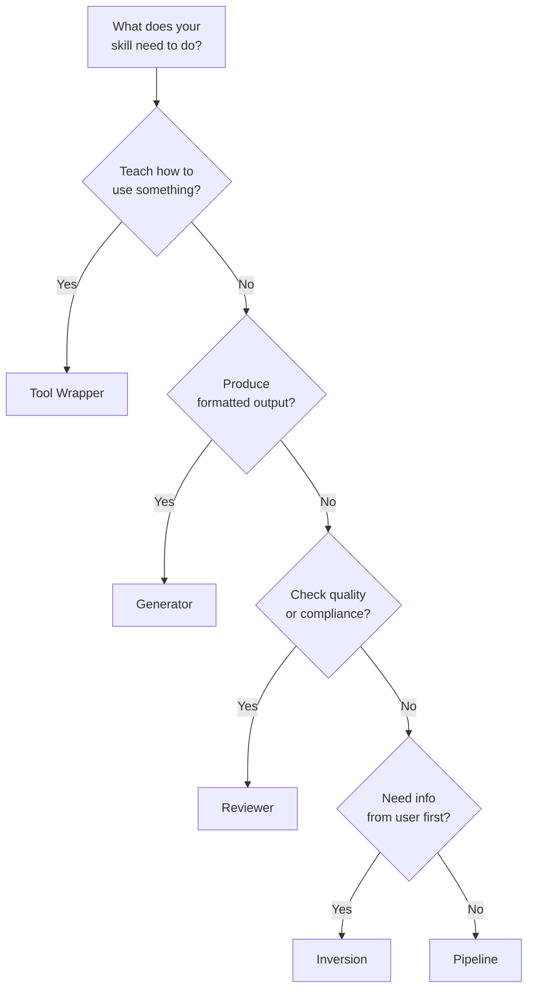

# Skill Design Patterns

五種結構化範本，幫你快速啟動 skills。挑一個 pattern，用 `skillshare new` 產生範本，再從那裡開始客製化。

:::tip Quick Start
用 `skillshare new my-skill -P <pattern>` 為任何 pattern 產生範本。執行 `skillshare new my-skill` 則會出現互動式選單。
:::

---

## Part 1：快速參考

### Pattern 總覽

| Pattern | 它做什麼 | 什麼時候用 |
|---------|-------------|----------|
| Tool Wrapper | 教會 agent 如何使用某個 library / API | Agent 需要領域特定的慣例 |
| Generator | 依範本產出結構化輸出 | 你需要一致的文件／程式碼格式 |
| Reviewer | 依檢查清單評分／稽核 | Code review、安全稽核、品質檢查 |
| Inversion | Agent 在行動前先訪談使用者 | 需求蒐集、專案規劃 |
| Pipeline | 附檢查點的多步驟工作流程 | 需要驗證關卡的複雜任務 |

### 該用哪個 Pattern？



### 用途分類

建立 skill 時，你也可以幫它加上**分類（category）**標籤，用來標示它的領域：

| Category | 說明 | 範例 |
|----------|-------------|----------|
| `library` | Library & API Reference | `billing-lib`、`internal-platform-cli` |
| `verification` | Product Verification | `signup-flow-driver`、`checkout-verifier` |
| `data` | Data Fetching & Analysis | `funnel-query`、`grafana` |
| `automation` | Business Process & Team Automation | `standup-post`、`weekly-recap` |
| `scaffold` | Code Scaffolding & Templates | `new-migration`、`create-app` |
| `quality` | Code Quality & Review | `adversarial-review`、`testing-practices` |
| `cicd` | CI/CD & Deployment | `babysit-pr`、`deploy-service` |
| `runbook` | Runbooks & Incident Response | `oncall-runner`、`log-correlator` |
| `infra` | Infrastructure Operations | `orphan-cleanup`、`cost-investigation` |

Categories 儲存在 SKILL.md 的 frontmatter 中，且與 patterns 相互獨立 — 任何 pattern 都能搭配任何 category。

---

## Part 2：詳細範例

### Tool Wrapper

透過嵌入慣例與使用範例，教會 agent 如何使用某個特定的 library、framework 或 API。

Agent 只需載入一次這些慣例，之後每當它撰寫或審查涉及該 library 的程式碼時就會套用。這能把領域特定的知識從你腦中搬進一個可重複使用的 skill。

**SKILL.md 範例：**

```markdown
---
name: billing-lib
description: >-
  Conventions for the billing-lib SDK. Use when writing or reviewing
  code that imports billing-lib or handles payment flows.
pattern: tool-wrapper
category: library
---

# Billing Lib

## Core Conventions

Load and follow the rules in `references/conventions.md` before writing any code.

## When Reviewing Code

- Check that all API calls follow the conventions
- Verify error handling matches the library's patterns
- Ensure imports and initialization are correct

## When Writing Code

- Follow the conventions from `references/conventions.md`
- Use idiomatic patterns for this library/API
- Include error handling for common failure modes
```

**目錄結構：**

```
billing-lib/
├── SKILL.md
└── references/
    └── conventions.md      # API patterns, error codes, initialization
```

**變化型：** 有些 tool-wrapper skills 會包含一份 `references/examples.md`，放可直接複製使用的程式碼片段；或是一份 `references/migration.md`，用於版本升級。

---

### Generator

依風格指南填入範本，產出結構化輸出（文件、設定檔、程式碼）。Agent 從使用者那裡蒐集變數，然後每次都產生一致的輸出。

**SKILL.md 範例：**

```markdown
---
name: rfc-writer
description: >-
  Generates RFC documents following the team template. Use when user
  says "write an RFC", "new proposal", or "design doc".
pattern: generator
category: scaffold
---

# RFC Writer

## Steps

### Step 1: Load Style Guide

Read `references/style-guide.md` for formatting and naming rules.

### Step 2: Load Template

Read `assets/template.md` as the base structure.

### Step 3: Gather Input

Ask the user what they need generated. Collect all required variables.

### Step 4: Generate

Fill in the template following the style guide. Ensure all placeholders are replaced.

### Step 5: Deliver

Present the generated output. Ask if adjustments are needed.
```

**目錄結構：**

```
rfc-writer/
├── SKILL.md
├── assets/
│   └── template.md         # RFC skeleton with placeholders
└── references/
    └── style-guide.md       # Formatting, section ordering, naming
```

**變化型：** 有些 generator 會省略風格指南，直接把所有規則放進範本中。另一些則在 `assets/` 中放多個範本，對應不同的文件類型。

---

### Reviewer

依定義好的檢查清單為工作評分或稽核。Agent 讀取審查目標、套用每一項標準，並產出附嚴重程度分級與合格／不合格分數的結構化報告。

**SKILL.md 範例：**

```markdown
---
name: pr-review
description: >-
  Reviews pull requests against the team quality checklist. Use when
  user says "review this PR", "check this code", or "audit quality".
pattern: reviewer
category: quality
---

# PR Review

## Steps

### Step 1: Load Checklist

Read `references/review-checklist.md` for the complete list of review criteria.

### Step 2: Understand

Read the code/document under review. Identify its purpose and scope.

### Step 3: Apply Rules

Evaluate each checklist item. Classify findings by severity:
- **Critical**: Must fix before proceeding
- **Warning**: Should fix, may cause issues later
- **Info**: Suggestion for improvement

### Step 4: Report

Produce a review report with:
1. Summary (pass/fail + one-line verdict)
2. Findings (severity, location, description)
3. Score (percentage of checklist items passed)
4. Top 3 recommended fixes
```

**目錄結構：**

```
pr-review/
├── SKILL.md
└── references/
    └── review-checklist.md  # Criteria with severity weights
```

**變化型：** 有些 reviewer skills 會包含一份 `references/examples.md`，展示每條規則的好壞範例對照。另一些則加上 `references/scoring-rubric.md`，用於加權評分。

---

### Inversion

翻轉一般互動方式：不是使用者告訴 agent 該做什麼，而是 agent 在採取行動前先訪談使用者以蒐集需求。這能避免「先做再問」的問題。

**SKILL.md 範例：**

```markdown
---
name: project-planner
description: >-
  Plans a new project by interviewing the user about goals, constraints,
  and success criteria. Use when user says "plan a project", "new feature
  spec", or "help me think through this".
pattern: inversion
category: automation
---

# Project Planner

**DO NOT start building until all phases are complete.**

## Phase 1: Discovery

Ask the user these questions before proceeding:
- What is the goal?
- Who is the audience?
- What does success look like?

## Phase 2: Constraints

Ask the user about constraints:
- What are the technical limitations?
- What is the timeline?
- Are there existing patterns to follow?

## Phase 3: Synthesis

Based on the answers, load `assets/template.md` and produce a plan.
Present the plan for approval before executing.
```

**目錄結構：**

```
project-planner/
├── SKILL.md
└── assets/
    └── template.md          # Plan document skeleton
```

**變化型：** 有些 inversion skills 會把固定的問題清單放進 `references/interview-questions.md`，而非寫在內文中。另一些則加上 Phase 0，在提問之前先讀取既有的專案上下文。

---

### Pipeline

編排一個多步驟工作流程，每個階段都有驗證關卡。Agent 必須通過每個檢查點才能繼續，這能防止複雜操作中的連鎖失敗。

**SKILL.md 範例：**

```markdown
---
name: deploy-staging
description: >-
  Deploys to staging with pre-flight checks and rollback plan. Use when
  user says "deploy to staging", "push to staging", or "staging release".
pattern: pipeline
category: cicd
---

# Deploy Staging

## Steps

### Step 1: Prepare

Gather inputs and validate prerequisites:
- Confirm branch is clean (`git status`)
- Run tests (`make test`)
- Check CI status

### Step 2: Gate Check

Present the plan to the user.

**Do NOT proceed until user confirms.**

### Step 3: Execute

Run the deployment pipeline. After each stage, verify output before continuing:
1. Build: `make build`
2. Push: `make push-staging`
3. Health check: `curl -sf https://staging.example.com/health`

### Step 4: Quality Check

Review results against `references/quality-checklist.md`.
Report pass/fail status for each criterion.
```

**目錄結構：**

```
deploy-staging/
├── SKILL.md
├── references/
│   └── quality-checklist.md  # Post-deploy verification criteria
├── assets/
│   └── rollback-plan.md      # Steps to undo if something fails
└── scripts/
    └── healthcheck.sh        # Automated health verification
```

**變化型：** 有些 pipelines 會包含一個 `scripts/` 目錄，放置由 agent 執行的自動化腳本。另一些則直接把回滾步驟寫進 SKILL.md 主文中。

---

## Patterns 可以組合

這些 patterns 是建構區塊，不是死板的模具。可依你實際需求組合使用：

- **Pipeline + Reviewer：** 一個部署流程，最後以品質審查步驟收尾，在標記完成前依檢查清單為部署結果評分。
- **Inversion + Generator：** 一個 RFC skill，先就目標與限制訪談使用者（Inversion），再用蒐集到的資訊填入範本（Generator）。
- **Tool Wrapper + Reviewer：** 一個 library skill，既教授慣例（Tool Wrapper），也能稽核既有程式碼是否合規（Reviewer）。

先從單一 pattern 開始，隨著你的 skill 範圍成長，再逐步疊加其他 patterns。

---

## 另請參閱

- [Skill Design](./skill-design.md) — 設計原則（determinism、progressive disclosure、複雜度匹配）
- [Creating Skills](/docs/how-to/daily-tasks/creating-skills) — 逐步建立指南
- [Skill Format](/docs/understand/skill-format) — SKILL.md 結構與 metadata
