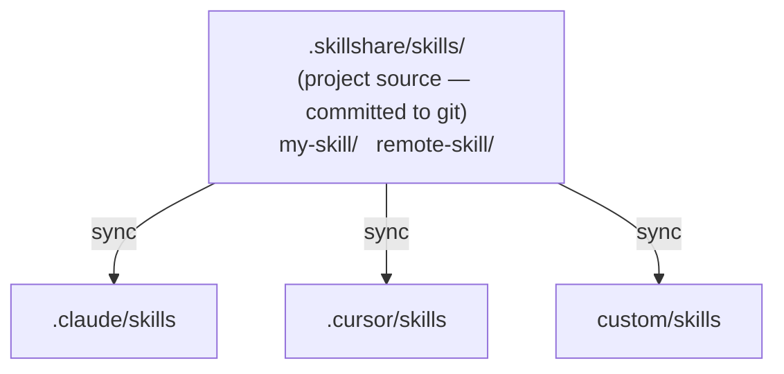

# Project Skills

在 project 層級執行 skillshare — 讓 skill 侷限於單一 repository，並透過 git 分享。

:::tip 這什麼時候重要？
當你的團隊需要 repo 專屬的 AI 指示（coding standards、部署指南、API 慣例），而這些內容不該放進你的個人 global skill 收藏時，就該使用 project skills。
:::

## 使用情境

| 情境 | 範例 |
|----------|---------|
| **Monorepo 導入** | 新開發者 clone repo，執行 `skillshare install -p && skillshare sync` — 立刻取得 project context |
| **API 慣例** | 把 API 風格指南嵌入為 skills，讓每個 AI 助理都遵循團隊慣例 |
| **領域專屬 context** | 有法規規則的金融應用、有合規指引的醫療應用 |
| **Project 工具** | 這個 repo 專屬的 CI/CD 部署知識、測試模式、遷移腳本 |
| **加速導入** | 「這裡的 auth 怎麼運作？」— AI 已經知道，因為 project skills 已被 commit |
| **開源專案** | 維護者 commit `.skillshare/`，讓貢獻者 clone 後就取得專案專屬的 AI context |
| **社群 skill 策展** | Repo 的 `config.yaml` 中的 `skills:` 區段作為一份精選 skill 清單 — 任何人都能透過 `install -p` 取得相同設定 |

---

## 概觀



---

## 自動偵測

當目前目錄存在 `.skillshare/config.yaml` 時，skillshare 會自動進入 project mode：

```bash
cd my-project/           # Has .skillshare/config.yaml
skillshare sync          # → Project mode (auto-detected)
skillshare status        # → Project mode (auto-detected)
```

:::tip 零設定
只要 `cd` 進入任何含有 `.skillshare/` 的 project — skillshare 就會自動偵測。不需要 flag、環境變數，也不需要任何設定。
:::

要強制指定特定模式：

```bash
skillshare sync -p       # Force project mode
skillshare sync -g       # Force global mode
```

---

## Global vs Project

| | Global Mode | Project Mode |
|---|---|---|
| **Source** | `~/.config/skillshare/skills/` | `.skillshare/skills/`（project root） |
| **Config** | `~/.config/skillshare/config.yaml` | `.skillshare/config.yaml` |
| **Targets** | 系統層級的 AI CLI 目錄 | 每個 project 各自的目錄 |
| **Sync mode** | Merge、copy 或 symlink（依 target 而定） | Merge、copy 或 symlink（依 target 而定，預設 merge） |
| **Tracked repos** | 支援（`--track`） | 支援（`--track -p`） |
| **Git 整合** | 選用（`push`/`pull`） | Skills 直接 commit 進 project repo |
| **範圍** | 機器上所有的 projects | 單一 repository |

對於只屬於你自己的 projects，還有第三種選擇：把資料夾列在 global config 的 [`projects`](/docs/reference/targets/configuration#projects) 底下。每個資料夾都會有自己的一組 skills、agents 與 MCP servers，不會有任何東西加進 repo，而且一次 `sync` 就能全部更新。該選哪一種請參見[多個 Projects，一份 Config](/docs/how-to/recipes/many-projects-one-config#scenario)。

---

## `.skillshare/` 目錄結構

```
<project-root>/
├── .skillshare/
│   ├── config.yaml              # Targets + settings (incl. extras)
│   ├── skills.lock.json         # Commit each remote skill is pinned to (auto-managed, commit it)
│   ├── skills/.metadata.json     # Runtime metadata (hashes, timestamps — auto-managed, gitignored)
│   ├── .gitignore               # Ignores logs/, trash/, backups/, and cloned remote/tracked skill dirs
│   ├── extras/                  # Extras source directories
│   │   └── rules/               # e.g. extras init rules --target .claude/rules -p
│   │       └── coding.md
│   └── skills/
│       ├── my-local-skill/      # Created manually or via `skillshare new`
│       │   └── SKILL.md
│       ├── remote-skill/        # Installed via `skillshare install -p`
│       │   └── SKILL.md
│       ├── tools/               # Category folder (via --into tools)
│       │   └── pdf/             # Installed via `skillshare install ... --into tools -p`
│       │       └── SKILL.md
│       └── _team-skills/        # Installed via `skillshare install --track -p`
│           ├── .git/            # Git history preserved
│           ├── frontend/ui/
│           └── backend/api/
├── .claude/
│   └── skills/
│       ├── my-local-skill → ../../.skillshare/skills/my-local-skill
│       ├── remote-skill → ../../.skillshare/skills/remote-skill
│       ├── tools__pdf → ../../.skillshare/skills/tools/pdf
│       ├── _team-skills__frontend__ui → ../../.skillshare/skills/_team-skills/frontend/ui
│       └── _team-skills__backend__api → ../../.skillshare/skills/_team-skills/backend/api
└── .cursor/
    └── skills/
        └── (same symlink structure as .claude/skills/)
```

Project mode 中的 symlink 使用**相對路徑**（例如 `../../.skillshare/skills/...`）。這讓 project 目錄具備可攜性 — 重新命名它、搬移它，或在另一台機器上 clone，所有 symlink 都能繼續運作。Global mode 則使用絕對路径，因為 source 與 targets 位在不同的檔案系統位置。

---

## 可見的 Project 目錄 {#visible-project-directory}

把 skills 視為可審閱內容而非工具狀態的 repository，可以使用可見的 `skillshare/` 目錄，取代隱藏的 `.skillshare/`：

```bash
skillshare init -p --visible
```

```
<project-root>/
├── skillshare/
│   ├── config.yaml
│   ├── skills/
│   └── agents/
└── src/
```

其他一切都相同 — `config.yaml`、`skills/`、`agents/`、`extras/`，以及操作用的 `trash/`、`backups/` 和 `logs/` 目錄，都位於目前使用中的 project 目錄裡。

偵測時會先檢查 `.skillshare/config.yaml`，接著才檢查 `skillshare/config.yaml`，因此：

- 既有的 projects 不受影響。
- 若兩個目錄都存在，`.skillshare/` 優先。
- 要搬移既有的 project，執行 `mv .skillshare skillshare`，然後執行 `skillshare sync -p` 來修復仍指向舊目錄的 target symlink。若你的 `sources` 設定明確參照了 `.skillshare/`，請在 sync 之前先更新 `config.yaml` 中的路徑。

不加 `--visible` 的 `init -p` 仍會建立 `.skillshare/`。

:::note
Global 設定目錄也叫做 `skillshare`（`~/.config/skillshare/`）。只有位於 project root 內的 `skillshare/` 目錄才會被視為 project。
:::

### 缺少 Config

當還沒有 project 時，project 指令會自動初始化一個，而使用 `--config local` 的[共享 skills repo](/docs/how-to/recipes/centralized-skills-repo) 也會以相同方式重新產生它被 gitignore 的 `config.yaml`。

但有一種情況例外：如果 project 目錄已經有 skills 或 agents，但其 `config.yaml` 遺失，重新初始化會寫入一個空的 config 並遺失所有已設定的 targets。這些指令會回報此問題而非直接動作，讓你可以從版本控制還原 `config.yaml`，或有意識地執行 `skillshare init -p`。

---

## Config 格式

`.skillshare/config.yaml`：

```yaml
targets:
  - claude                    # Known target (uses default path)
  - cursor                         # Known target
  - name: custom-ide               # Custom target with explicit path
    path: ./tools/ide/skills
    mode: symlink                  # Optional: "merge" (default), "copy", or "symlink"
  - name: codex                    # Optional filters (merge mode)
    include: [codex-*]
    exclude: [codex-experimental-*]
```

**Targets** 支援兩種格式：
- **簡短格式**：只有 target 名稱（例如 `claude`）。使用已知的預設路徑、merge 模式。
- **完整格式**：物件，包含 `name`、選用的 `path`、選用的 `mode`（`merge`、`copy` 或 `symlink`），以及選用的 `include`/`exclude` 篩選條件。支援相對路徑（從 project root 解析）與 `~` 展開。

遠端 skill 依賴關係在 `config.yaml` 的 `skills:` 之下宣告：

```yaml
targets:
  - claude
  - cursor

skills:
  - name: pdf
    source: anthropic/skills/pdf
  - name: _team-skills
    source: github.com/team/skills
    tracked: true
  - name: review
    source: github.com/team/skills/code-review
    group: frontend
```

**Skills** 清單只宣告遠端安裝的項目。本機 skills 不需要在這裡建立項目。

- `tracked: true`：以 `--track` 安裝（保留 `.git/` 的 git repo）。當有人執行 `skillshare install -p` 時，tracked skills 會連同完整 git 歷史一起 clone，讓 `skillshare update` 能正常運作。
- `group`：子目錄路徑（對應到安裝時的 `--into`）。

執行期 metadata（安裝時間戳記、檔案雜湊值、commit SHA）另外儲存在 `.skillshare/skills/.metadata.json` 中 — 此檔案為自動管理且被 gitignore。

:::tip 可攜的 Skill Manifest
`config.yaml` 就是宣告式的 skill manifest。在 project 中，把它 commit 進 git，任何人都能執行 `skillshare install -p && skillshare sync`。至於 global mode，由於 global config 不需要透過 git 分享，`.metadata.json` 就扮演 manifest 的角色。
:::

### Lockfile {#lockfile}

`config.yaml` 說明一個 skill 跟隨的對象，例如某個 repo 的預設分支。`.skillshare/skills.lock.json` 則記錄上次有人安裝或更新它時，那是哪一個 commit。把兩者都 commit 進 git，任何人執行 `skillshare install -p` 都會得到相同的內容，即使 upstream repo 之後已經往前推進。

```json
{
  "version": 1,
  "skills": {
    "pdf": {
      "source": "github.com/anthropics/skills/skills/pdf",
      "commit": "8f14e45fceea167a5a36dedd4bea2543ce848564",
      "tree_hash": "f88c87101780018cfabdd229d5d92abedd6f640e"
    }
  }
}
```

這個檔案是自動幫你寫入的，你永遠不需要自己編輯它：

| 指令 | 對 lockfile 的影響 |
|---------|------------------------|
| `skillshare install <source> -p` | 把新 skill 釘選到它安裝時的 commit |
| `skillshare install -p` | 依釘選的 commit 安裝每個 skill。若某個 skill 已安裝在其他 commit，會被移動到釘選的 commit |
| `skillshare update <name> -p` | 把 skill 移動到最新 commit 並重寫它的釘選，讓這項變更能出現在 code review 中 |
| `skillshare uninstall <name> -p` | 移除釘選 |

Tracked repos 也會被釘選。它們會被重設到釘選的 commit，但仍留在原本的分支上，讓 `skillshare update` 還是能繼續 pull。一旦 skill 在 `config.yaml` 中的 `source` 不再與釘選相符，該釘選就會被忽略。Local-path 來源沒有 commit，也不會被釘選。

釘選只會在你移動 skill 時跟著移動，也就是執行 `update` 或強制重新安裝的時候。如果隊友的釘選比你本機的版本新，其他指令不會動它，直到你執行 `skillshare install -p` 把本機更新到該版本。Tracked repo 若有未 commit 的變更，`install -p` 不會移動它，請先 commit 或捨棄變更。

用較舊版本 skillshare 安裝的 skill 沒有記錄 commit，會在下次更新或重新安裝時被釘選。

Lockfile 與 `--branch <sha>` 不同：該旗標會把 skill 永久釘選，`update` 只會重新安裝同一個版本。使用 lockfile 時，skill 仍會持續跟隨它的分支，只有明確執行 `update` 才會移動它。

---

## 自訂 Source 目錄 {#custom-source-directories}

預設情況下，project mode 會從 `.skillshare/skills/`、`.skillshare/agents/` 和 `.skillshare/extras/` 讀取 skills、agents 和 extras。當你想把 skill 內容放在其他 project 文件旁邊時，可以用選用的 `sources` map 來覆寫這些路徑：

```yaml
sources:
  skills: ./docs/skills
  agents: ./docs/agents
  extras: ./docs/extras
targets:
  - claude
```

每個 key 都是選用的 — 省略某個 key 時會退回預設的 `.skillshare/<type>/` 路徑。路徑是相對於 project root 解析的，絕對路徑（包含 `~`）也可以使用。

**常見配置：**

```yaml
# Co-locate skill content with existing project docs
sources:
  skills: ./docs/skills

# Keep agents in an AI-focused subdirectory
sources:
  agents: ./ai/agents
```

**限制：**

- **不可與 target 路徑重疊。** `skillshare sync -p` 會拒絕 source 解析結果與 target 相同目錄（或其中一者包含另一者）的設定。這是為了防止 `sync --force` 清空已設定的 source。舉例來說，`sources.skills: .claude/skills` 搭配 `claude` target 會被拒絕，並回報 `overlaps` 錯誤。
- **外部路徑不會納入 gitignore 管理。** 當 source 解析到 project root 之外的位置（磁碟上其他地方的絕對路徑）時，skillshare 不會在 project 的 `.gitignore` 中新增項目。若有需要，請自行在該 source 目錄中管理 ignore 規則。
- **操作用目錄仍留在 project 目錄中。** Trash、backups 和 operation logs 一律位於目前使用中的 project 目錄底下（`.skillshare/`，或如下所述的 `skillshare/`），無論 `sources` 設定為何。
- **`init -p` 一律會在 project 目錄中建立 `{skills,agents}/`。** 自訂 sources 只有在你編輯 `config.yaml` 之後才會生效。

---

## 模式限制

Project mode 有一些刻意設計的限制：

| 功能 | 是否支援？ | 備註 |
|---------|-----------|-------|
| Merge sync mode | ✓ | 預設，每個 skill 各自 symlink |
| Copy sync mode | ✓ | 透過 `skillshare target <name> --mode copy -p` 針對個別 target 設定 |
| Symlink sync mode | ✓ | 透過 `skillshare target <name> --mode symlink -p` 針對個別 target 設定 |
| `--track` repos | ✓ | Clone 到 `.skillshare/skills/_repo/`，並加入 `.gitignore`（預設也會忽略 `logs/`、`trash/` 和 `backups/`） |
| `--discover` | ✓ | 偵測並將新的 targets 加入既有的 project config |
| `push` / `pull` | ✗ | 直接對 project repo 使用 git |
| `collect` | ✓ | 從 project targets 收集本機 skills 回 `.skillshare/skills/` |
| `extras` | ✓ | Extras sync、init、list、remove、collect — 都支援 `-p` |
| `backup` / `restore` | ✗ | 不需要（project targets 可重現） |

---

## 何時使用：Project vs Organization

| 需求 | 使用 |
|------|-----|
| 只限**單一 repo**的 skills（API 風格、部署、領域規則） | **Project skills** — commit 進該 repo |
| 跨**所有 projects** 共享的 skills（coding standards、security audit） | **Organization skills** — 透過 `--track` 的 tracked repos |
| 為特定 project **導入**新成員 | **Project skills** — clone + install + sync |
| 為整個組織 **導入**新成員 | **Organization skills** — 一個安裝指令即可 |
| 同時需要 repo context **和**組織標準 | **兩者並用** — 它們可以獨立共存 |

---

## 另請參閱

- [Project Setup](/docs/how-to/sharing/project-setup) — 逐步設定指南
- [Project Workflow](/docs/how-to/daily-tasks/project-workflow) — Project mode 的日常使用
- [Organization-Wide Skills](/docs/how-to/sharing/organization-sharing) — 團隊層級的分享
