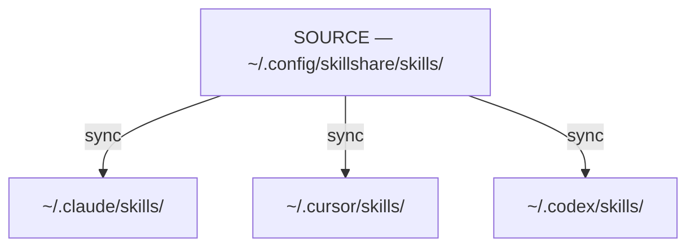
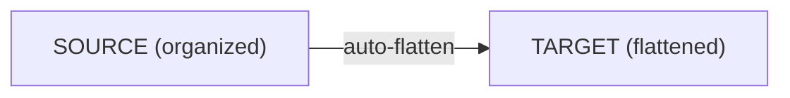

# Source & Targets

skillshare 背後的核心模型：一個 source，多個 targets。

:::tip 這在什麼時候重要？
理解 source 與 targets 的差異，能讓你知道該在哪裡編輯 skills 與 agents（永遠在 source 編輯 — 變更會透過 symlink 反映出去）、為什麼 `sync` 是獨立的一個步驟，以及 `collect` 如何反向運作。
:::

## 問題所在

沒有 skillshare 的話，你得為每個 AI CLI 分別管理 skills：

```
~/.claude/skills/         # Edit here
  └── my-skill/

~/.cursor/skills/         # Copy to here
  └── my-skill/           # Now out of sync!

~/.codex/skills/          # And here
  └── my-skill/           # Also out of sync!
```

**痛點：**
- 在一處編輯不會傳播出去
- Skills 隨時間漸漸失去一致性
- 沒有單一事實來源

---

## 解決方案

skillshare 引進一個會同步到所有 **targets** 的 **source 目錄**：



**好處：**
- 在 source 編輯 → 所有 targets 立即更新
- 在 target 編輯 → 變更會回到 source（透過 symlink）
- 單一事實來源

---

## 為什麼 Sync 是獨立的一個步驟 {#why-sync-is-a-separate-step}

`install`、`update`、`uninstall` 這類操作只會修改 **source** 目錄。獨立的 `sync` 步驟才會把變更傳播到所有 targets。這個兩階段設計是刻意為之：

**先預覽再傳播** — 執行 `sync --dry-run` 可以在套用前檢視所有 targets 會發生什麼變化。在 `uninstall` 或 `--force` 操作之後特別有用。

**批次處理多個變更** — 安裝 5 個 skills，再 sync 一次。如果沒有分開，每次 install 都會對所有 targets 觸發完整掃描與 symlink 更新。

**預設安全** — Source 的變更是暫存的，不會立即生效。你可以完全掌控 targets 何時更新。此外，`uninstall` 會把 skills 移到垃圾桶目錄（保留 7 天）而非直接永久刪除，所以誤刪是可以復原的。

:::tip 例外：pull
`pull` 會在 `git pull` 之後自動執行 sync。因為它的用意是「把所有東西從遠端拉到最新」，自動 sync 符合預期行為。
:::

:::info 什麼時候不需要 sync
編輯既有的 skill 不需要 sync — symlink 讓變更能立即反映在所有 targets 中。只有當 skills 的集合改變時（新增、移除、重新命名），或是 targets／modes 改變時，才需要 sync。
:::

---

## Source 目錄

**預設位置：** `~/.config/skillshare/skills/`

這裡是：
- 你建立與編輯 skills 的地方
- Skills 被安裝到的地方
- Git 追蹤變更的地方（用於跨機器同步）

:::tip Symlink 化的 source 目錄
Source 目錄本身可以是一個 symlink — 在使用 dotfiles 管理工具（GNU Stow、chezmoi、yadm）時很常見。例如 `~/.config/skillshare/skills/ → ~/dotfiles/ss-skills/`。skillshare 會在掃描前解析 symlink，因此所有指令都能無縫運作。也支援多層串接的 symlink。
:::

**結構：**
```
~/.config/skillshare/skills/
├── my-skill/
│   └── SKILL.md
├── code-review/
│   └── SKILL.md
├── _team-skills/          # Tracked repo (underscore prefix)
│   ├── frontend/
│   │   └── ui/
│   └── backend/
│       └── api/
└── ...
```

### 用資料夾組織（自動扁平化） {#organize-with-folders-auto-flattening}

你可以用資料夾整理自己的 skills — 同步到 targets 時會自動扁平化：



**好處：**
- 依專案、團隊或分類整理 skills
- 不需要手動扁平化
- AI CLI 拿到的是它們預期的扁平結構
- 資料夾名稱會變成前綴，方便追溯來源

---

## Agents Source

Agents 是與 skills 平行的一種資源類型。它們有自己獨立的 source 目錄，緊鄰 `skills/`，並遵循相同的 source-and-targets 模型：

```
~/.config/skillshare/
├── skills/                    # Skills source (directories)
│   └── my-skill/
│       └── SKILL.md
└── agents/                    # Agents source (single .md files)
    ├── reviewer.md
    └── auditor.md
```

同一次 `skillshare init` 執行會同時建立這兩個目錄。Agents 是單一 `.md` 檔案（沒有巢狀目錄），透過 `skillshare sync`（或 `skillshare sync agents` 只針對 agents）同步。

**支援 agents 的 targets。** 並非每個 AI CLI 都提供 agents 目錄。支援的 targets 有：

- `~/.claude/agents/` — Claude Code
- `~/.cursor/agents/` — Cursor
- `~/.augment/agents/` — Augment
- `~/.config/opencode/agents/` — OpenCode
- `~/.factory/droids/` — Droid

其他 targets 在 agent sync 時會被靜默略過（並顯示 `target(s) skipped for agents (no agents path)` 警告）。適用於 skills 的 merge / copy / symlink 三種模式，同樣適用於 agents。

完整的 agent 檔案格式、`.agentignore` 規則與探索機制，請見 [Agents](/docs/understand/agents)。

---

## 自訂 Source 目錄

預設情況下，global mode 會從 `~/.config/skillshare/skills/` 讀取 skills、從 `~/.config/skillshare/agents/` 讀取 agents，並從 skills source 推導出 extras 的上層目錄。自 v0.19.16 起，可選用的頂層 `sources` map 讓你能覆寫其中任何一項：

```yaml
# ~/.config/skillshare/config.yaml
sources:
  skills: ~/work/skills
  agents: ~/work/agents
  extras: ~/work/extras
targets:
  claude:
    skills:
      path: ~/.claude/skills
```

每個 key 都是選用的 — 省略某個 key 就會保留其內建預設值。路徑支援 `~`（家目錄展開）與絕對路徑。

**常見配置：**

```yaml
# Point all three at a shared dotfiles directory
sources:
  skills: ~/dotfiles/skillshare/skills
  agents: ~/dotfiles/skillshare/agents
  extras: ~/dotfiles/skillshare/extras

# Override only skills; agents and extras keep their defaults
sources:
  skills: ~/projects/team-skills
```

### 向下相容

v0.19.16 之前的頂層欄位仍然可以使用，行為不變：

```yaml
# Legacy format — fully supported, no auto-migration on save
source: ~/.config/skillshare/skills
agents_source: ~/.config/skillshare/agents
extras_source: ~/.config/skillshare/extras
```

當兩種格式同時存在時，`sources.<key>` 的值會覆蓋對應的舊欄位。既有設定檔不會被自動重寫；只有全新的 `skillshare init` 執行才會產生新的 `sources:` 格式。

### 何時需要注意

Project mode 也有相同的功能（project mode 的形式，包含如何使用相對於專案根目錄的相對路徑，請見 [Project Skills](/docs/understand/project-skills#custom-source-directories)）。

---

## Targets

Targets 是 skillshare 會同步過去的 AI CLI skill 目錄。

**常見 targets：**
- `~/.claude/skills/` — Claude Code
- `~/.cursor/skills/` — Cursor
- `~/.agents/skills/` — OpenAI Codex CLI（共用的 `universal` 目錄）
- `~/.gemini/config/skills/` — Antigravity（app）
- `~/.gemini/antigravity-cli/skills/` — Antigravity CLI
- `~/.gemini/skills/` — Gemini CLI
- 以及 [64+ 種其他工具](/docs/reference/targets/supported-targets)

**自動偵測：** 執行 `skillshare init` 時，會自動偵測已安裝的 AI CLI 並將它們加入 targets。

**手動新增：**
```bash
skillshare target add myapp ~/.myapp/skills
```

---

## Sync 如何運作

### Source → Targets（`sync`）

```bash
skillshare sync
```

從每個 target 建立指向 source 的 symlink：
```
~/.claude/skills/my-skill → ~/.config/skillshare/skills/my-skill
```

### Target → Source（`collect`）

```bash
skillshare collect claude
```

把 target 中的本機 skills 收集回 source：
1. 在 target 中找出非 symlink 的 skills
2. 複製到 source（會自動排除 `.git/` 目錄）
3. 替換成 symlink

---

## 編輯 Skills

因為 targets 是透過 symlink 連到 source，你可以從任何地方編輯：

**在 source 編輯：**
```bash
$EDITOR ~/.config/skillshare/skills/my-skill/SKILL.md
# Changes visible in all targets immediately
```

**在 target 編輯：**
```bash
$EDITOR ~/.claude/skills/my-skill/SKILL.md
# Changes go to source (same file via symlink)
```

---

## 另請參閱

- [sync](/docs/reference/commands/sync) — 把變更從 source 傳播到 targets
- [collect](/docs/reference/commands/collect) — 把 skills 從 targets 拉回 source
- [Sync Modes](./sync-modes.md) — 檔案如何被連結（merge、copy、symlink）
- [Agents](./agents.md) — Agent 資源模型與探索機制
- [Configuration](/docs/reference/targets/configuration) — Target 設定參考
