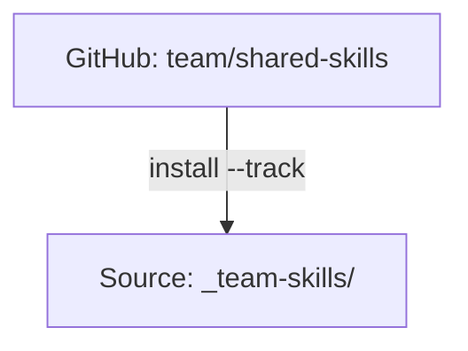

# Tracked Repositories

用 `--track` 安裝的 Git repos，方便團隊共享與輕鬆更新。

:::tip 這在什麼時候重要？
Tracked repos 是組織分發共享 skills 的方式。用 `--track` 安裝一次，之後只要一個指令就能更新。變更會從維護者的 repo 流向每一位團隊成員。
:::

## 總覽

Tracked repositories 是被 clone 進你 source 中的 git repos，並保留其 `.git` 目錄。這讓你能：

- **團隊共享**：每個人都安裝同一個 repo
- **輕鬆更新**：`skillshare update <name>` 會執行 git pull
- **版本控制**：追蹤你目前所在的 commit



---

## 一般 Skills 與 Tracked Repos 的差異

| 面向 | 一般 Skill | Tracked Repo |
|--------|---------------|--------------|
| Source | 複製到 source | 以 `.git` 一併 clone |
| 更新 | `install --update` | `update <name>`（git pull） |
| 前綴 | 無 | `_` 前綴 |
| 巢狀 skills | 扁平化 | 以 `__` 扁平化 |

---

## 安裝 Tracked Repo

```bash
skillshare install github.com/team/shared-skills --track
skillshare sync
```

**會發生什麼事：**
1. Repo 會被 clone 到 `~/.config/skillshare/skills/_team-skills/`
2. `.git` 目錄會被保留
3. Clone 目錄會被加入受管理的 `.gitignore` 區塊，讓它保持機器本機、不會被當成巢狀 git repository 被 commit 進去
4. 整個 repo 會用當前生效的安裝門檻（`audit.block_threshold` 或 `--threshold`）進行安全稽核
5. 巢狀 skills 會被扁平化，供 AI CLI 使用

若發現項目達到門檻，安裝會被封鎖，除非使用 `--force`。被封鎖時，skillshare 會自動移除已 clone 的 repo；若清理失敗，指令會回報確切路徑供手動清理。

---

## 底線前綴

Tracked repos 會以 `_` 為前綴，以便與一般 skills 區分：

```
~/.config/skillshare/skills/
├── my-skill/           # Regular skill (no prefix)
├── code-review/        # Regular skill
└── _team-skills/       # Tracked repo (underscore prefix)
```

---

## 巢狀 Skills 與自動扁平化 {#nested-skills--auto-flattening}

Skill repos 經常把 skills 組織在資料夾中。skillshare 會自動為 AI CLI 將它們扁平化：

```
SOURCE                              TARGET
(your organization)                 (what AI CLI sees)
────────────────────────────────────────────────────────────
_team-skills/
├── frontend/
│   ├── react/          ───►   _team-skills__frontend__react/
│   └── vue/            ───►   _team-skills__frontend__vue/
├── backend/
│   └── api/            ───►   _team-skills__backend__api/
└── devops/
    └── deploy/         ───►   _team-skills__devops__deploy/

• _ prefix = tracked repository
• __ (double underscore) = path separator
```

### 為什麼要自動扁平化？

| 好處 | 說明 |
|---------|-------------|
| **AI CLI 相容性** | 多數 AI CLI 預期 skills 位於扁平目錄，而非巢狀資料夾 |
| **保留組織結構** | 在 source 中保留邏輯性的資料夾結構，同時滿足 CLI 的要求 |
| **可追溯性** | 扁平化後的名稱能顯示來源路徑（例如 `_team__frontend__react` → 來自 `_team/frontend/react/`） |
| **無需手動處理** | skillshare 在 sync 期間自動完成轉換 |

**你負責組織，skillshare 負責適配。** 用任何資料夾結構撰寫 skills，它們都能到處運作。

:::tip
自動扁平化適用於**所有 skills**，不只是 tracked repos。你也可以用資料夾整理自己的個人 skills。詳見 [Organize with Folders](/docs/understand/source-and-targets#organize-with-folders-auto-flattening)。
:::

---

## 全新 Clone 之後的復原 {#rehydrating-after-a-fresh-clone}

Tracked repo 的 clone 目錄被刻意排除在 git 之外，因為它們自己含有 `.git` 目錄。如果你在新機器上 clone 或 pull 你的 skillshare source repo，`.metadata.json` 可能已經宣告了 tracked repos，但 `_team-skills/` 這個 clone 目錄卻還不存在。

執行不帶參數的 install，可以從 metadata 重新建立缺少的 tracked repo clone：

```bash
skillshare install
skillshare sync
```

Project mode 則執行：

```bash
skillshare install -p
skillshare sync -p
```

`status`、`check`、`update --all` 與 `doctor` 會回報缺少的 tracked repo clone，並建議使用 `skillshare install`，而非靜默忽略。

---

## 更新 Tracked Repos

### 單一 repo

```bash
skillshare update _team-skills
skillshare sync
```

### 所有 tracked repos

```bash
skillshare update --all
skillshare sync
```

**會發生什麼事：**
```
cd ~/.config/skillshare/skills/_team-skills
git pull origin main
```

**更新期間的安全行為：**
- 拉取後的內容會被稽核。
- 封鎖與否依當前生效的門檻決定（預設為 `audit.block_threshold`，或依指令個別覆寫的 `--threshold`/`-T`）。
- 在 TTY 模式下，`skillshare update` 於發現項目達到門檻時會提示確認；在非 TTY 模式下則自動回滾（除非使用 `--skip-audit`）。
- 若被拒絕，tracked repos 會回滾到先前的 commit 以保留本機狀態。
- 若回滾基準點擷取失敗，為求安全，更新會中止（fail-closed）。

---

## 解除安裝

```bash
skillshare uninstall _team-skills
```

**會發生什麼事：**
1. 檢查是否有未 commit 的變更（若有會提出警告）
2. 移除該目錄
3. 下次 `sync` 時，會從 targets 移除對應的 symlink

---

## Project Mode

Tracked repos 在 project mode 下同樣適用。Repo 會被 clone 到 `.skillshare/skills/`，並加入 `.skillshare/.gitignore`（避免 tracked repo 自己的 git 歷史與你的專案 git 衝突）。Project 的日誌（`.skillshare/logs/`）、垃圾桶（`.skillshare/trash/`）與備份（`.skillshare/backups/`）預設也會被忽略。

安裝 tracked repo 會自動在 `.skillshare/.metadata.json` 中記錄 `tracked: true`，讓新加入的團隊成員透過 `skillshare install -p` 就能取得正確的 clone 行為：

```json
{
  "skills": [
    {
      "name": "_team-shared-skills",
      "source": "github.com/team/shared-skills",
      "tracked": true
    }
  ]
}
```

```bash
# Install tracked repo into project
skillshare install github.com/team/shared-skills --track -p
skillshare sync

# Update via git pull
skillshare update team-skills -p
skillshare sync

# Force update (discard local changes)
skillshare update team-skills -p --force

# Uninstall
skillshare uninstall team-skills -p
```

**目錄結構：**

```
<project-root>/
└── .skillshare/
    ├── .gitignore           # Contains: logs/, trash/, and skills/_team-skills
    └── skills/
        └── _team-skills/    # Tracked repo with .git/ preserved
            ├── .git/
            ├── frontend/ui/
            └── backend/api/
```

如果你刻意想要 commit project 的日誌，可以在 `.skillshare/.gitignore` 受管理區塊之後加上 `!logs/` 與 `!logs/*.log`。

巢狀 skills 的自動扁平化方式與 global mode 相同 — `_team-skills/frontend/ui` 在 targets 中會變成 `_team-skills__frontend__ui`。

---

## 自訂名稱

```bash
skillshare install github.com/team/skills --track --name acme-skills
# Installed as: _acme-skills/
```

`--track --name` 的名稱限制：
- 必須能對應成以 `_` 開頭的 tracked repo 目錄名稱。
- 不能包含路徑分隔符（`/`、`\`）或上層目錄跳脫（`..`）。
- 不合法的名稱會在 clone 前就被拒絕。

---

## 追蹤特定 Branch

你可以追蹤某個 repository 的特定 branch：

```bash
skillshare install github.com/team/skills --track --branch frontend
```

Tracked repo 會 clone 並跟隨指定的 branch。透過 `skillshare update` 更新時，會自動從該 branch 拉取。

若要在多個 branch 上安裝同一個 repo，用 `--name` 避免名稱衝突：

```bash
skillshare install github.com/team/skills --track --branch frontend --name team-frontend
skillshare install github.com/team/skills --track --branch backend --name team-backend
```

Branch 同樣適用於一般（非 tracked）安裝：

```bash
skillshare install github.com/team/skills --branch develop --all
```

Branch 會被記錄在 skill metadata 中，因此 `skillshare update` 與 `skillshare check` 會自動使用正確的 branch。

若需要可重現的安裝，`--branch` 也接受 tag 或 commit SHA：

```bash
skillshare install github.com/team/skills --branch v1.2.0 --all
skillshare install github.com/team/skills --branch 8f14e45 --all
```

Tag 與 commit SHA 不能搭配 `--track`：tracked repo 是從 branch pull，detached 的 checkout 沒有東西可以 pull。請改用一般安裝來釘選 tag 或 SHA。

---

## 名稱衝突偵測

當多個 skills 共用相同的 `name` 欄位時，sync 會檢查它們在套用 `include`/`exclude` 過濾之後，是否真的落到同一個 target 上。

**過濾已隔離衝突** — 僅供參考：

```
ℹ Duplicate skill names exist but are isolated by target filters:
  'ui' (2 definitions)
```

**衝突延伸到同一個 target** — 可採取行動的警告：

```
⚠ Target 'claude': skill name 'ui' is defined in multiple places:
  - _team-a/frontend/ui
  - _team-b/components/ui
Rename one in SKILL.md or adjust include/exclude filters
```

**最佳做法** — 為 skills 加上命名空間，或使用過濾：

```yaml
# Option 1: Namespace in SKILL.md
name: team-a-ui

# Option 2: Route with filters (global config)
targets:
  codex:
    path: ~/.codex/skills
    include: [_team-a__*]
  claude:
    path: ~/.claude/skills
    include: [_team-b__*]
```

```yaml
# Option 2: Route with filters (project config)
targets:
  - name: claude
    exclude: [codex-*]
  - name: codex
    include: [codex-*]
```

完整語法與範例請見 [Target Filters](/docs/reference/targets/configuration#include--exclude-target-filters)。

---

## 另請參閱

- [install](/docs/reference/commands/install) — 用 `--track` 安裝
- [update](/docs/reference/commands/update) — 拉取最新變更
- [check](/docs/reference/commands/check) — 查看可用的更新
- [Organization-Wide Skills](/docs/how-to/sharing/organization-sharing) — 團隊共享指南
